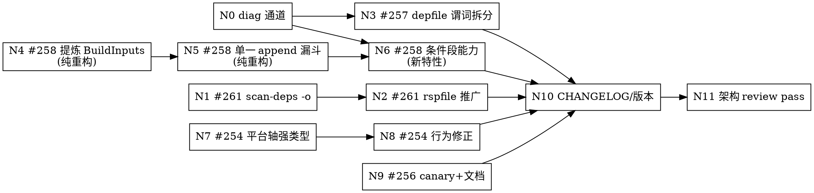

# v0.0.102 批次设计 —— #261 / #257 / #258 / #254(+#256 收尾)

> 日期:2026-07-22
> 基线:HEAD = `af25d18`(mcpp **0.0.101**,`MCPP_VERSION` @ `src/toolchain/fingerprint.cppm:21`),工作树 clean
> 前置分析:[2026-07-22-issue-triage-254-261.md](2026-07-22-issue-triage-254-261.md)(六条 issue 的裁决与证据)
> 交付形态:**单 PR,逐节点 commit**,全部实现完成后做整体架构 review commit,再 CI 全绿 → bypass squash 合入 → 发布 → xlings 全生态验证
> 架构主线:批次总账 §5.2 **一数据模型、多文法、单一收敛漏斗;同一决策不许两处推导**;本批次新增第二条 **失败必须响,不许静默降级**(§1.2)

---

## 0. 决策记录(2026-07-22)

| # | 决策 | 选择 | 理由 |
|---|------|------|------|
| 1 | #258 实现形态 | **提炼 `BuildInputs` 类型**,让类型系统回答"什么能被条件化" | 见 §5.1——白名单方案是把"手工子集"换个地方放,且编码的是调用顺序这个偶然属性 |
| 1b | #258 范围 | **只做能力,不动未知键策略**(2026-07-22 决定) | 未知键策略三处不一致是独立问题,已开 [#263](https://github.com/mcpp-community/mcpp/issues/263);它有兼容性面,与 #258 的解锁诉求无依赖 |
| 2 | #254 收敛深度 | **强类型 + 行为修正** | 平台轴混用今天零编译期阻力;只改行为下次还会传错 |
| 3 | 静默降级 | **统一降级报告通道 `mcpp::diag`**(范围已收窄,见 §2.0) | 四条 issue 共享同一失效模式,逐点修不解决复发 |
| 4 | **#259** | **移出本批次**(2026-07-22 决定) | 根因在 xlings 侧;调查结论已发 issue 评论,mcpp 侧修复另行安排 |
| 5 | #256 | **本批次收尾:canary e2e + 文档一节**;上游报告单独提 | 低风险、闭合批次;上游修复不受本 PR 约束 |

### 0.1 #259 的调查结论(已移出实施范围,结论存档)

调查推翻了 issue 正文的归因,也推翻了"mcpp 从外界复制 payload"的假设,但发现了一个此前未知的 mcpp 侧 bug。三条结论已作为评论发到 [#259](https://github.com/mcpp-community/mcpp/issues/259):

1. **llvm.lua 确实声明了 glibc**(`pkgs/l/llvm.lua:25-31`,自 `8e432d99` 起),且在 glibc 缺失时是 fail-loud 的。原归因撤回。
2. **mcpp 没有绕过 xlings 的依赖解析**:`XLINGS_HOME` 恒为 `$MCPP_HOME/registry`,三条安装路径全部汇入 `xim::cmd_install` 且无条件 `resolve(catalog,…)`。
3. **但 mcpp 自己的 sysroot 兜底是死代码**(新发现):`lifecycle.cppm:562-567` 与 `prepare.cppm:1074-1076` 用无版本的 `"xim:glibc"` 调用 `resolve_xpkg_path`,而后者要求 `<name>@<version>`(`package_fetcher.cppm:805-810`),必然立即失败;两处都丢弃返回值,失败从未可见。
4. **真因(xlings 侧)**:`xim/installer.cppm:906-950` 的 dep 节点失败是 `log::warn + continue`,不进 `plannedDownloads`;Phase 2 守卫只管已计划节点 ⇒ 不产生 `InstallPhase::Failed`,退出码 0。

后续工作(不在本批次):xlings 侧跨仓 issue;mcpp 侧的兜底复活 + 安装完整性闸 + doctor 的 PT_INTERP 检查。

---

## 1. 总体架构

### 1.1 本批次触及的三条架构主线

```
主线 A —— 命令行长度与 shell 依赖(#261)
    ninja 规则发射:凡命令行含无界内容(-I 列表、对象列表),
    windows 一律走 rspfile;shell 重定向从规则文本中彻底消失。

主线 B —— 条件轴的统一(#258)
    「哪些构建输入可以被条件化」今天在 cfg 轴与 feature 轴各推导一遍、
    答案还不同。提炼 BuildInputs 类型 + 单一 append 漏斗,让类型回答该问题。

主线 C —— 轴的类型化与降级的可见性(#254、#257)
    平台 host/target 两轴在类型层不可混;
    任何「因条件不满足而少做一步」必须经 diag 通道上报。
```

### 1.2 新增架构不变量:**失败必须响**

写入批次总账,并作为本 PR 的 review 判据:

> 任何"因为条件不满足而少做一步"的分支,必须要么返回错误,要么经 `mcpp::diag::degraded` 上报;
> `log::debug` / `log::verbose` **不算**用户可见。
> 丢弃 `std::expected` 返回值(`(void)expr` 或不接收)在本仓视为缺陷。

本批次范围内被这条不变量命中的现存代码:

| 位置 | 现状 | 归属 |
|---|---|---|
| `ninja_backend.cppm:496-502` | clang 上无声不发 depfile | #257,本批次修 |

(#259 的四处见 §0.1;`toml.cppm:976-987` 的条件段未知键静默丢弃属 [#263](https://github.com/mcpp-community/mcpp/issues/263),两者本批次均不动。)

### 1.3 节点依赖图



四条链(N1→N2、N3、N4→N5→N6、N7→N8)互不耦合,可并行实现;**N0 先落**。

---

## 2. N0 —— 统一降级报告通道 `mcpp::diag`

### 2.0 范围说明(#259 移出后的重新评估)

`diag` 原本最重的消费者是 #259 的四个静默点。#259 移出后,本批次内的**降级**消费者只剩 #257 一处(windows + clang/gcc 无 POSIX depfile),#258 的未知键走的是硬错而非降级。

仍然保留 N0,理由有三,但**范围收窄**:

1. 决策 3 要把"失败必须响"立为跨模块不变量,需要一个可被 review 指向的具体机制,否则它只是一句口号;
2. `--strict` 提升策略今天在 `prepare.cppm` 里 copy-paste 了 5 处(`:722-726 / 800-809 / 2295-2302 / 3020-3029 / 3060-3067`),收敛到单点是独立收益;
3. 告警内容今天**无法单测**(只能靠 e2e grep stderr),sink 可查询后首次可单测。

**收窄之处**:存量迁移只做 `prepare.cppm` 内的 10 处裸 `println(stderr, "warning: ...")` 与 `ScanError` 冲刷(同文件、同冲刷时机);跨 6 个文件的 11 处 `ui::warning` 本批次不动。若认为 N0 仍嫌重,它可整体移出——#257 的降级点退回直接调用 `ui::warning`,批次其余部分不受影响。

### 2.1 设计

新增 `src/diag.cppm`:

```cpp
export namespace mcpp::diag {

enum class Severity { Warning, Degraded };

struct Record {
    Severity    severity;
    std::string domain;    // "build/depfile" | "manifest/target-cfg"
    std::string what;      // 发生了什么
    std::string impact;    // 对用户的后果 —— Degraded 必填
    std::string hint;      // 可选:怎么办
};

// 降级:引擎因条件不满足而少做一步。impact 必填。
void degraded(std::string_view domain, std::string_view what,
              std::string_view impact, std::string_view hint = {});

void warning(std::string_view domain, std::string_view what,
             std::string_view hint = {});

// 汇总:去重、计数、统一渲染;--strict 下 Degraded 提升为错误(单点策略)
[[nodiscard]] bool flush(bool strict);
std::size_t count(Severity);
}
```

`impact` 必填是这条通道的核心——它强制作者回答"用户会因此遭遇什么",而这正是 #257 当年缺的那句话。

渲染复用 `ui::warning` 的着色实现,输出字节形态不变 ⇒ 现有 e2e 的 grep 断言不破。

### 2.2 验收

- 单测 `tests/unit/test_diag.cpp`:去重、计数、strict 提升。
- 现有 e2e(`109_per_glob_flags.sh:55`、`146_feature_flags.sh:71,85`、`67_features_strict.sh`、`93_xpkg_parse.sh`、`103_target_vocabulary.sh`)**逐字节不变**通过 = 迁移无回归。

### commit

```
feat(diag): single degradation/warning sink — impact-bearing records, one --strict policy
```

---

## 3. N1 / N2 —— #261 windows scan-deps 命令行

### 3.1 N1:去 `cmd /c`,改 `-o $out`

`src/build/ninja_backend.cppm:665-674` 两分支合一:

```cpp
} else {
    // Clang path: clang-scan-deps writes P1689 JSON to -o (LLVM 17+).
    // No shell redirection => no `cmd /c` on Windows => the rule runs on
    // ninja's CreateProcess path (32767) instead of cmd.exe's 8191 ceiling.
    append("  command = $scan_deps -format=p1689 -o $out -- "
           "$cxx $local_includes $cxxflags $unit_cxxflags -c $in -o $compile_target\n");
}
```

`-o` 可用性已实证(本机 20.1.7 / 22.1.8 均有该选项,实跑产出合法 P1689 JSON)。此改动使 `cmd /c` **在全仓 ninja 规则中彻底消失**(`:299` 的另一处是 compile_commands 过滤器的字符串前缀判断,不是规则,保留)。

**不做**:不加 LLVM 版本闸。仓库无最低版本机制(`clang.cppm:246-252` 纯路径探测),自带工具链下限 20.1.7 ≫ 17,加闸是凭空造机制。

### 3.2 N2:rspfile 从"链接规则"上移为"含无界内容的规则"

现状 `useRsp`(`:602`)只覆盖 `cxx_link`/`cxx_archive`/`cxx_shared`。N1 只把天花板从 8191 抬到 32767,**长度轴本身没治**——`local_include_flags()`(`:102-127`)每依赖一个 `-I`,无上界;`cxx_object`/`cxx_module`/`c_object`/`cxx_scan` 在 windows 上全无兜底。

抽出与 `link_rule` 同源的 `rsp_rule` 发射器,windows 上给**所有含 `$local_includes` 的规则**加 `rspfile`:

```
rule cxx_object
  command = $cxx @$out.rsp -c $in -o $out        # windows
  rspfile = $out.rsp
  rspfile_content = $local_includes $cxxflags $unit_cxxflags
```

复用 #247 已踩过的两条经验(`:594-602` 注释 + 0.0.100 复盘):

1. rsp 内容按 **GNU 文法**分词,反斜杠是转义符 ⇒ 路径必须 `generic_string()` 正斜杠;
2. POSIX 保持内联零变化(ARG_MAX 充裕,手工复现命令的可读性更值钱)。

**范围纪律**:只改 windows 分支;msvc 方言规则与 POSIX 规则文本**逐字节不变**(与 #247 同款约束)。

### 3.3 验收

- 单测:(a) 全仓规则文本不含 `cmd /c`;(b) windows 下 `cxx_scan`/`cxx_object`/`cxx_module` 含 `rspfile`,POSIX 下不含。
- **回归靶**:构造 60+ `include_dirs` 的 fixture 包,断言 windows 上 scan+compile 均成功。这是把"消费者视角"补进 CI 的第一步(triage 报告 §7.2)。

### commit

```
fix(build): #261 clang scan-deps writes via -o — drop the cmd /c wrapper and its 8191 ceiling
fix(build): #261 windows response files cover every rule carrying $local_includes
```

---

## 4. N3 —— #257 clang purview include 重建

### 4.1 设计:一个 bool 拆成两个谓词

`ninja_backend.cppm:496-502` 现在把两件无关的事捆在一起:

- **要不要发 depfile**(`-MMD` + `deps = gcc` + `depfile = $out.d`)
- **要不要跑 awk 过滤器**(剥掉 GCC `-fmodules` 的 reversed make-rules)

0.0.97 因为第二件事没验证过,把第一件事一起 gate 掉了。**实测表明这个耦合没有必要**:

```
clang 20.1.7 / 22.1.8:  x.o: x.cppm ops.inc                 ← 干净,ninja 直接可吃
gcc 16.1.0:             x.o gcm.cache/x.gcm: x.cppm ops.inc
                        x.c++-module: gcm.cache/x.gcm       ← 正是过滤器要剥的
                        .PHONY: x.c++-module
                        gcm.cache/x.gcm:| x.o
```

改为:

```cpp
// 发 depfile:所有 POSIX 非 MSVC 编译器(GCC ∪ Clang)。textual include
// 跟踪是构建正确性的最小契约,不是可选优化。
const bool posixDepfile = !msvcDeps && !mcpp::platform::is_windows;
// 剥离 reversed make-rules:只有 GCC 的 -fmodules 产出这种形状(实测
// clang 的 module-TU depfile 是单条普通 rule)。
const bool needsGnuModuleFilter =
    posixDepfile && plan.toolchain.compiler == mcpp::toolchain::CompilerId::GCC;
```

### 4.2 剩余降级面必须上报

MSVC 走 `deps = msvc` / `/showIncludes`,是等价机制,不算降级;**windows + clang/gcc** 是真降级,接 N0:

```cpp
diag::degraded("build/depfile",
    "此工具链/平台组合不发出 GNU depfile",
    "模块接口 purview 内 #include 的文件被修改后不会触发重建,可能使用陈旧 BMI",
    "改动 .inc/私有头后请 touch 对应的 .cppm");
```

同时 `c_object` / `asm_object` 今天也无 depfile,一并纳入 `append_cxx_deps`,消除"只有 C++ 边被跟踪"的第二个不对称。

### 4.3 验收

- e2e `118_purview_include_rebuild.sh`:**删除 `# requires: gcc`**,改为 gcc 与 clang 双腿覆盖。本节点的核心断言。
- 新增 e2e:模块接口 purview `#include` 一个 `.inc`,改 `.inc` 后 `mcpp build`,断言 BMI mtime **前进**且新符号进入产物。
- 单测:`test_ninja_backend.cpp:76-111` 的 GCC-only skip 改为双编译器断言——GCC 含 awk 过滤器,Clang 含 depfile 但**不含**过滤器。

### commit

```
fix(build): #257 depfile emission covers Clang — split "emit depfile" from "filter GCC module rules"
```

---

## 5. N4 / N5 / N6 —— #258 条件轴统一

### 5.0 这个 issue 的核心是什么

一个能力,两个直接后果——验收标准就是这三条,不多:

- **能力**:`[target.'cfg(os)'.build]` 能写 `flags = [{ glob, defines, ... }]`,表达 per-OS 的 per-glob 编译旗标,**包括撤销**(windows 上必须没有 `HAVE_UNISTD_H`,而 unix 上必须有;`-U` 反条目本身也需要 OS 条件化,递归回同一缺口)。
- **后果 1 —— 删掉 703 个多余文件**:`gen/windows/tu/w/` 426 + `wdnn/` 277 个 stub,每个只有一行 `#include`,**存在的唯一目的是给 windows TU 制造 OS-唯一的路径**,好让全局 flag 表能 key 上去。它们是真进源集的文件——要被 scan、被编译。连同 32 条指向它们的 glob 一起消失。
- **后果 2 —— 消除 23 条结构性死 glob 告警**:成因是 `sources` 可以 OS 条件化而 `flags` 不能,所以一份 manifest 覆盖三个 OS 时,每个 OS 必然看到另外两个 OS 的 flag 条目,必然零命中。这个消除**由结构给出**:不匹配当前 OS 的条目根本不进 `globFlags`,`globFlagHits` 里没有它,`scanner.cppm:933-948` 无从告警。与 #253 对 feature 轴的做法同构。

**不在核心内**:未知键的报错/告警策略。那是共用解析器这一实现手段带来的独立话题,已拆为 [#263](https://github.com/mcpp-community/mcpp/issues/263)(见 §5.1 末段)。

### 5.1 为什么不是"白名单"

初版方案是"条件段共用 `BuildConfig` 解析器 + 一张 `kConditionalBuildKeys` 白名单"。这个方案自我矛盾:#258 的论证是"条件段维护手工键子集是复发源",而白名单**仍是一份手工维护的键子集**,只是从解析器挪到常量表;而且它编码的是一个**偶然属性**——"该字段的消费点碰巧在 `prepare.cppm:912` 之后"。调用顺序一变,表就静默失准。

还有一个更实际的风险:如果共用的是**整个 `BuildConfig`** 的解析器,`linkage = "static"` 这类键会在条件段里**解析成功、写进结构体、然后无人读取**(消费点 `:880-893` 早于合并点 `:912`)——把今天的"静默丢弃"换成更隐蔽的"静默无效"。

初版方案打算用"硬错"来堵这个洞。这个补丁方向是错的:`[build]` 自己今天**就没有**未知键拒绝(每个键都是正向 `doc->get("build.X")`,`build.cxx_flags` 拼错一样静默忽略),只给条件段加硬错会造出新的不对称;而且对现存 manifest 是行为破坏。正确的做法是让这个洞**在结构上不存在**——见 §5.3:共用的是 `BuildInputs` 的解析器,而 `BuildInputs` 里根本没有 `linkage` 的槽位。至于落到"未知键"路径之后该忽略/告警/报错,那是全仓五处策略不一致的独立问题,已拆为 [#263](https://github.com/mcpp-community/mcpp/issues/263),本批次不动。

### 5.2 真正的病灶:`BuildConfig` 混装了三类语义

| 类别 | 字段 | 合并语义 | 能否被条件化 |
|---|---|---|---|
| **① 选型轴**(谓词求值的**输入**) | `target` `linkage` `defaultProfile` | 解析定型 | **构造性不能**(`:823-824` 读 `build.target` 来*选定* triple,而谓词求值需要该 triple——循环) |
| **② 已解析策略标量** | `optLevel` `debug` `lto` `strip` `staticStdlib` `cStandard` `allowHostLibs` `macosDeploymentTarget` `dialectCxxflags` | 覆盖(last-wins) | 需 last-wins 语义的独立设计;`dialectCxxflags` 更是模块图全局(types.cppm:191-198),根本不是 per-package |
| **③ 可叠加的构建输入** | `sources` `cflags` `cxxflags` `ldflags` `globFlags` `includeDirs` `includeDirsAfter` | **追加** | 任何条件轴唯一该承载的东西 |

而 mcpp **今天已经有两条条件轴**,各自手挑了 ③ 的一个子集,**答案还不同**:

```
cfg 轴  (ConditionalConfig)                 携带:sources, cflags, cxxflags, ldflags
feature 轴(featureSources/Flags/Defines)    携带:sources, flags, defines
```

这就是批次总账要消灭的那句话的教科书实例:**"哪些构建输入可被条件化"这个决策在两处各推导一遍。** #258 的症状(cfg 轴没有 `flags`)只是该分歧的一个切面。

### 5.3 N4:提炼 `BuildInputs`(纯重构)

```cpp
// 可叠加的构建输入 —— 任何条件轴(cfg / feature)唯一能贡献的东西。
// 私有、per-package、追加语义。
struct BuildInputs {
    std::vector<std::string>            sources;
    std::vector<std::string>            cflags, cxxflags, ldflags;
    std::vector<GlobFlags>              globFlags;   // 含 per-glob defines(私有 per-TU,不传播)
    std::vector<std::filesystem::path>  includeDirs, includeDirsAfter;
};

struct BuildConfig {
    BuildInputs base;                              // [build] 的可叠加部分
    std::string target, linkage, defaultProfile;   // ① 选型轴
    bool staticStdlib; std::string cStandard; ...  // ② 策略标量
};

struct ConditionalConfig {
    std::string  predicate;
    BuildInputs  inputs;                           // 取代四个裸字段
    std::map<std::string, DependencySpec> dependencies, devDependencies, buildDependencies;
};

std::map<std::string, BuildInputs> featureInputs;  // feature 轴同一类型
```

**关键收益**:"什么能被条件化"不再需要任何表来声明——`BuildInputs` 里没有 `linkage` 槽位,条件段里写 `linkage` 就落到既有的"未知键"路径(策略由 [#263](https://github.com/mcpp-community/mcpp/issues/263) 统一决定,本批次沿用现状),**不会**出现"解析成功却无人读取"的静默无效。白名单退化为**类型的字段集**,不会与结构体漂移;将来加字段时"要不要可条件化"变成一个必须回答的**类型归属**问题,而不是一张可以忘记更新的表。

读取侧三处需随之调整(纯机械):fingerprint 序列化(`prepare.cppm:234-260` 改为序列化一个 `BuildInputs`)、scanner 种子、`makePackageRoot` 快照。

**本节点行为逐字节不变**,由现有全量 e2e 锁死。

### 5.4 两个排除项的原则性理由

不是"顺序上不方便",而是范畴不同:

- **`generatedFiles`**:它不是构建**输入**,是一个**写磁盘的副作用动作**(materialize)。动作与输入分属不同范畴,不进 `BuildInputs`。这也顺带解释了它为何在 root/dep 两条路径上顺序相反(`:1165` 在合并后、`:1853` 在合并前)——那是动作调度问题,单独修(见 §11 非目标)。
- **`featureDefines`**:它沿 Public 边**传播给消费者**(`:2910-2923`),是**接口贡献**而非私有构建输入。`types.cppm:152-158` 早已写下这条界线(`defines`=接口开关 / `flags`=构建配方),只是没在类型上兑现;本节点兑现它。

这条界线正好把 #258 的真实用例干净放行:opencv 需要的是 `{ glob = "…/zlib/**", defines = ["NO_FSEEKO"] }`,那是 `GlobFlags::defines`——私有、per-TU、不传播(`types.cppm:123-124`)——在 `BuildInputs` 内。windows 的 additions 与 removals 全部可表达,而"接口开关不该按本包 target 条件化"这条约束一并守住。

### 5.5 N5:单一 `append` 漏斗(纯重构)

```cpp
void append(BuildInputs& dst, const BuildInputs& src);
```

一次性取代:

- `merge_conditional_sources_flags`(`prepare.cppm:425-447`,cfg 轴,4 字段)
- feature 的 `apply()` 折入(`prepare.cppm:2887-2975`、`3001-3008`)

顺带把函数名从 `merge_conditional_sources_flags` 改为 `merge_conditional_build_inputs`(现名已名不副实)。三个调用点(`:912 / :1871 / :2762`)与"必须在 `makePackageRoot` 快照之前"的顺序不变量(`:900-909` 注释)保持不变。

追加顺序:base → cfg 条件段 → feature(按名序),即"last flag wins",这正是表达 windows"撤销 unix `-DHAVE_UNISTD_H`"所需的覆盖权。

### 5.6 N6:条件段能力(新特性)

到这一步,#258 退化为"给 `ConditionalConfig::inputs` 接上 `BuildInputs` 的解析器"的自然结果:

- `toml.cppm:976-987` 的四次 `read_list` → `parse_build_inputs(bt, cc.inputs)`,与 `[build]` 共用;
- `xpkg.cppm:1047-1105` 的 `target_cfg` 同款替换 ⇒ 两文法一数据模型闭合;
- xpkg 的 `mcpp.<os>` 段因文本拼接机制本就免费支持(`xpkg.cppm:888-894`),无需改动。

**各文法现有的未知键策略原样保留**:xpkg `target_cfg` 今天对未知子键硬错(`xpkg.cppm:1085-1090`),替换解析器后仍硬错(不得借重构之名放松);mcpp.toml 沿用现状。策略统一见 [#263](https://github.com/mcpp-community/mcpp/issues/263)。

**正确的抽象会让原本的特性请求变成免费结果**——这也是检验 N4/N5 做对了没有的判据。§5.0 的两个后果(703 个 stub、23 条死 glob 告警)到这里全部由结构给出,不需要额外机制。

**显式拒绝** `optional = true` / `?`-前缀 这类逃生口(#258 评论中的 stopgap 提议)——那会成为第二套告警抑制机制,与 #253 已确立的"条目按条件*存在*"路线并存,正是"同一决策两处推导"。

### 5.7 验收

- 单测(N4/N5):现有 manifest/build 单测全绿且**无需修改断言**=重构无行为变化。
- 单测(N6):条件段 `flags` / `include_dirs` 解析;OS 匹配与不匹配的合并结果;last-wins 覆盖(base `-DX=1` + 条件段 `-UX`);cfg 轴与 feature 轴对同一 `BuildInputs` 的折入顺序;xpkg `target_cfg` 未知子键**仍**硬错(防重构放松)。
- e2e:三 OS 表 fixture——(a) 命中 OS 的 per-glob defines 落到 TU;(b) 非命中 OS 的条目**零告警**(负向断言,e2e 146 已有先例);(c) 条件段覆盖 base 的 removal 场景(unix 有 `-DHAVE_UNISTD_H=1`、windows 没有)。
- **最终验收(生态侧,§9)**:opencv-m 落 parked 的 windows 表 → 删 703 个 stub 文件 + 32 条 glob → 三个 OS 各自零死 glob 告警 → windows 腿绿。这三条才是 #258 的真正合格线。

### commit

```
refactor(manifest): extract BuildInputs — the one type any conditional axis may contribute
refactor(build): cfg axis and feature axis fold through a single append(BuildInputs&)
feat(manifest): #258 per-glob flags / include dirs in [target.'cfg(...)'.build] (xpkg target_cfg parity)
```

---

## 6. N7 / N8 —— #254 平台轴

### 6.1 N7:轴的类型化

今天两轴都是 `std::string_view`,混用零阻力:

```cpp
synthesize_from_xpkg_lua(lua, name, ver, osOverride);   // 空 ⇒ 宿主编译期常量
list_xpkg_versions(lua, kXpkgPlatform);                  // 宿主编译期常量
```

引入不可互换的类型(`src/platform/axis.cppm`):

```cpp
export namespace mcpp::platform {
// xpkg 平台词汇:linux / macosx / windows。两轴故意不可互相转换 ——
// 「按哪个平台选段」是一个必须显式声明的决策(设计文档 §6)。
class HostPlatform   { public: static HostPlatform current(); std::string_view key() const; ... };
class TargetPlatform { public: static TargetPlatform from_triple(std::string_view); ... };
}
```

`synthesize_from_xpkg_lua` / `list_xpkg_versions` 的平台形参改为**必填**的轴类型(去掉 `= {}` 默认值)⇒ 每个调用点被迫声明取哪一轴,传错编译失败。lint 路径(`--all-os`)用显式的 `ExplicitPlatform` 逃生构造。

### 6.2 N8:行为修正(分类已核实)

| 调用点 | 今天 | 改为 | 理由 |
|---|---|---|---|
| `prepare.cppm:1589` | host | **target** | 校验 installed layout 用的是编进构建的源码包 |
| `prepare.cppm:1637` | host | **target** | dep manifest 合成 + preinstall hooks |
| `prepare.cppm:1814` | host | **target** | dep 的构建 manifest |
| `pm/resolver.cppm:108` | host (`kXpkgPlatform`) | **target** | 用户项目的库依赖版本/资产选择 |
| `toolchain/lifecycle.cppm:135` | host | **host(不变)** | 宿主工具,注释已写明为何 |
| `cmd_xpkg.cppm:132` | 遍历三 OS | 不变 | lint |

`resolver.cppm` 的错误文案今天把宿主平台名硬写进去,一并改为报告实际使用的轴。

### 6.3 验收(零行为变化必须被锁死)

- **单测:host == target ⇒ 拼接结果逐字节不变**(`NativeBuildSpliceIsUnchanged`)。这是本节点的安全网:native 三平台 CI 的全部现状必须不变。
- 单测:逐 target OS 断言只拼接自己那一段、不携带另两段(`XpkgPerOsSectionSplicesForTheTargetNotTheHost`)。
- 单测:轴类型互传不可编译(`static_assert(!std::is_convertible_v<...>)`),且都不能由裸字符串构造。
- **已知覆盖缺口(实施期记录)**:原计划的"mingw-cross 腿消费带 per-OS 段的 xpkg dep"e2e **未落地**。该用例需要在一个临时 `MCPP_HOME` 里完成真实交叉构建,而临时 home 会触发整套交叉工具链的重新安装(实测超 10 分钟),现有 e2e 基础设施没有共享工具链、注入本地索引与预置 payload 的组合手段。折中:语义由上述两条单测精确锁定;真实交叉构建路径由既有 `102_mingw_cross_wine.sh` / `112_build_mcpp_cross.sh` 覆盖(但它们不消费此类 dep)。**若要补齐,需要先给 e2e 增加"复用宿主 registry + 项目级本地索引 + 预置 payload"的夹具**,单独做。

### commit

```
refactor(platform): host/target platform axes become distinct types — mixing them is a compile error
fix(build): #254 xpkg per-OS sections and version tables key on the resolved target
```

---

## 7. N9 —— #256 收尾(canary + 文档)

mcpp 侧无代码缺陷,做两件事:

1. **e2e canary**:issue #256 的 3 文件复现(已实证 clang 20/22 崩、clang 18 与 gcc 16 过)进 `tests/e2e/`,`# requires: clang`。
   注意:今天两个自带 LLVM 都会崩 ⇒ canary 若直接断言"必须编过"会立刻红。因此初版断言的是**已知状态**(clang 版本 → 期望结果的映射表),状态变化即提示复核。这是 known-issue canary 的标准形态,作用是让未来任一次 clang bump 修好或再弄坏这件事立即可见。
2. **文档一节**(模块包指南):"运算符模板的所有模板参数应由第一个实参绑定;否则改为对整个推导操作数类型建模",附 opencv-m `42aeb20` 的改写范式。

**上游 LLVM 报告**单独提(不占本 PR),提后回链 issue #256。

### commit

```
test(e2e): #256 clang module operator-template canary (known-issue state matrix)
docs: module-package guidance — operator template shapes that poison importer lookup on clang 20+
```

---

## 8. N10 / N11 —— 收口

### N10:文档 / CHANGELOG / 版本

- `MCPP_VERSION` `0.0.101` → **`0.0.102`**(`src/toolchain/fingerprint.cppm:21`)
- CHANGELOG 按既有中文格式:一句主旨 + 新增/修复/备注三段,引用本设计文档
- 批次总账追加 §1.2 的**失败必须响**不变量
- 手册:`[target.'cfg(...)'.build]` 的 `flags`/`include_dirs` 语法;`BuildInputs` 作为"可条件化输入"的概念说明(替代逐键罗列)

### N11:整体架构 review pass

全部节点完成后**单独一轮**,对照 0.0.100 的 `2dbb0f9 refactor(build): architecture-review pass` 先例。检查项:

1. **同一决策两处推导**:本 PR 是否引入新的双推导点?(重点:diag 与 `ui::warning` 并存期间的策略一致性;平台轴类型化后是否还有裸 string 漏网;`BuildInputs` 之外是否还残留第三条"条件贡献"路径)
2. **失败必须响**:逐一复核本 PR 触碰的每个 `if (...) return;` / `continue` / 丢弃 `expected`
3. **规则文本对称性**:ninja 三方言(gnu / msvc / nasm)在 N1/N2 后仍逐字节符合"只有 windows 变"的约束
4. **词汇表一致性**:`BuildInputs` 字段集、`kKnownXpkgKeys`、#227 AOT allowlist 三处是否有遗漏交叉
5. 命名:`merge_conditional_build_inputs` 等改名全仓一致(禁用口袋名纪律)

```
refactor: architecture-review pass — <收敛点>
```

---

## 9. 交付流程

```
1. 分支 fix/batch-254-261(worktree 隔离)
2. 逐节点实现 + commit(N0 → N11),每节点自带单测/e2e
3. 本地全量:单测 + e2e(host 腿)+ clang/gcc 双工具链各跑一次
4. 开 PR:标题引用四个 issue(#261 #257 #258 #254),正文引本设计文档
5. CI 全绿:ci-linux / ci-linux-e2e / ci-macos / ci-windows / cross-build-test
   —— #261 的真实验证依赖 windows 腿;#254 依赖 cross-build-test 腿
6. bypass squash 合入 main(自 PR 需 --admin)
7. 发布 0.0.102:release 四平台 → 镜像 xlings-res(gh + gtc 双端,sha256 独立核验)
   → xim-pkgindex PR → xlings install 真装 0.0.102 验证 → bootstrap pin bump
8. 生态验证:
   - mcpp-index:workspace(windows)腿 —— #261 的原始现场,必须由绿变绿且不再出现 8191
   - opencv-m feat/vendor-single-repo:落 parked 的 windows 表,删 703 个 stub 文件 + 32 条 glob,
     验证 #258 的实际解锁面
```

---

## 10. 风险登记

| 风险 | 等级 | 缓解 |
|---|---|---|
| N2 rspfile 推广在 windows 引入路径转义回归(#247 同款) | 中 | 复用 `generic_string()` 纪律;msvc/POSIX 规则文本逐字节不变的单测 |
| N3 clang 开 depfile 后 ninja 因意外 depfile 形状报错 | 低 | 已实测形状干净;e2e 118 双腿覆盖是硬闸 |
| **N4/N5 是本批次最大改动**(触及 fingerprint、scanner 种子、makePackageRoot 三处读取点) | 中高 | 拆成两个纯重构 commit,验收标准是"现有断言无需修改";N6 才引入行为变化,可独立 revert |
| N7 类型化触及 pm/toolchain/prepare 三模块 | 中 | 先落类型与签名(编译期一次暴露全部调用点),再逐点改行为;host==target 逐字节不变 e2e 锁底 |
| 单 PR 体量偏大 | 中 | 四条链互不耦合,逐节点 commit 可独立 revert;N11 单独 review 收口 |

---

## 11. 非目标

- **#259 全部工作**(sysroot 兜底复活、安装完整性闸、doctor PT_INTERP 检查)——结论存档于 §0.1 与 issue 评论,另行安排
- xlings 侧 installer 的 per-dep skip 修复(跨仓)
- LLVM 上游 #256 的修复本身
- `ui::warning` 存量 11 处调用点的全量迁移(跨 6 文件,与本批次无关)
- **未知键策略的统一** —— 全仓五处策略不一致(silent / warning / hard error),已开 [#263](https://github.com/mcpp-community/mcpp/issues/263);有兼容性面,与 #258 的解锁诉求无依赖,单独走
- **② 类策略标量的条件化**(`linkage`/`cStandard`/profile 组)—— 需 last-wins 语义的独立设计
- **`generatedFiles` 的条件化与调用序修正** —— 它是副作用动作而非构建输入(§5.4);root/dep 两路径 materialize 与 merge 的顺序不一致本身是隐患,单开
- `copy_xpkg_from_global` 这条不带 dep 链的 payload 移植回退路径的重新评估(#259 调查中发现的潜在洞,非其机制)
