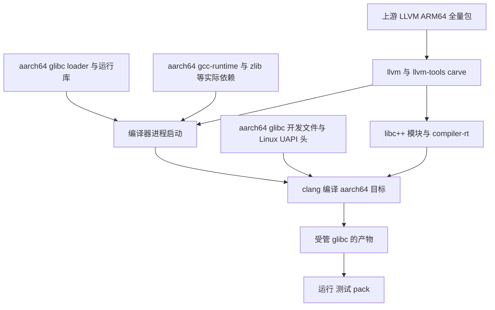

# LLVM 23.1.3 Part 2：Linux aarch64 默认工具链与 glibc 生态闭环

本记录提出 xim-pkgindex 与 mcpp 的第二阶段联动方案，供维护者 review。
方案尚未实施；文中的验收门与命令属于计划，不表示已经测过。
本轮用户要求新增 Linux aarch64 支持并以 LLVM 23.1.3 为默认，取代
Part 1 对这一宿主暂缓的裁决。Linux x86_64 保留 GCC 默认。

相关记录：[Part 1](2026-10-07-llvm-2313-unified-default-cross-repo-design.md)、
[aarch64 生态闭环历史分析](2026-08-26-aarch64-linux-ecosystem-closure.md)、
[glibc-world 历史计划](todos/2026-06-23-aarch64-glibc-world-llvm-buildout-plan.md)。
规则依据：[SPEC-006](../../docs/specs/toolchain-management.md)、
[SPEC-009](../../docs/specs/toolchain-maintenance.md)。历史记录不就地改写；
本记录列明哪些前提已经变化。

## 1. 交付目标与默认值

交付结果是：在没有用户配置的 Linux aarch64 上，安装 mcpp 后直接
`mcpp new hello`、`mcpp build`、`mcpp run`，解析 `llvm@23.1.3`，生成
aarch64 glibc 产物，使用受管 aarch64 C 库、libc++ 与 compiler-rt。
显式 `--target aarch64-linux-gnu` 同样可构建和运行。

| 宿主或目标 | Part 2 交付后的选择 | 边界 |
|---|---|---|
| Linux x86_64 宿主默认 | `gcc@16.1.0` | 延续 Part 1 D1 |
| Linux aarch64 宿主默认 | `llvm@23.1.3` | 本轮新增；glibc 原生目标 |
| 其他非 x86_64 Linux 宿主默认 | 既有 `gcc@15.1.0-musl` | 不因 aarch64 就绪而推广 |
| macOS、Windows with MSVC | Part 1 的 `llvm@23.1.3` | 完成 review 修正后保留 |
| Windows without MSVC | `gcc@16.1.0` / Windows GNU | 修复或验证 #783 |
| aarch64-linux-musl 显式目标 | 既有 GCC musl 路线 | 静态发布继续使用这一行 |
| aarch64-linux-gnu 显式目标 | 原生 aarch64 Linux 上 LLVM 23.1.3 | 本阶段只承诺原生宿主 |

“LLVM 默认”只更换 aarch64 的宿主默认工具链，不自动升级使用者已有
配置，不把 musl 行换为 glibc，也不把 Linux x86_64 默认换为 LLVM。
GCC 全量 aarch64 glibc 工具链不是此目标的先决条件；gcc-runtime
是否需要由 LLVM 实际 ELF 依赖决定。

## 2. 已核查的事实与仍需实测的前提

快照日期为 2026-10-08。mcpp #781 头为 `4d320fb3`，仍为 draft/open；
xim-pkgindex #936 已于 2026-10-07 合入。读取 GitHub 当前配方时记录了
文件 blob，而未以相邻工作树的版本替代 main。

| 事实 | 核查结果与来源 |
|---|---|
| 上游有 ARM64 全量包 | [llvmorg-23.1.3 release](https://github.com/llvm/llvm-project/releases/tag/llvmorg-23.1.3)，`LLVM-23.1.3-Linux-ARM64.tar.xz`，1,829,163,444 字节 |
| 上游资产内容摘要 | GitHub API 的 digest 为 `sha256:56d005e339c979a696ed6c244e6472e16f3b1371e48987a07e6145bda7ee0d03`；本轮未下载全包，仍须下载后核验 |
| xlings-res 暂无该宿主载荷 | [23.1.3 资产列表](https://github.com/xlings-res/llvm/releases/tag/23.1.3) 有 linux-x86_64 的 llvm/llvm-tools，无 linux-aarch64 |
| LLVM 配方不能直接服务 aarch64 | [llvm.lua](https://github.com/openxlings/xim-pkgindex/blob/main/pkgs/l/llvm.lua) 的 archs 为 x86_64/arm64；Linux 解包目录写死 linux-x86_64；Linux 依赖五个配套包 |
| glibc 配方仍按 x86_64 描述 | [glibc.lua](https://github.com/openxlings/xim-pkgindex/blob/main/pkgs/g/glibc.lua)：archs 仅 x86_64，loader 与 ABI 写死 x86_64，多处 lib64 假设；latest 2.44.3 的资产为 2.44.3-r1 |
| 配套包缺声明或路由 | linux-headers、gcc-runtime、zlib、libxml2 的当前配方均只声明 x86_64；llvm-tools 的 Linux URL 写死 x86_64 |
| mcpp 有两处独立阻挡 | `available_toolchain_indexes()` 对非 x86_64 Linux 隐藏 LLVM；`kKnownTargets` 中 aarch64-linux-gnu 为 planned |
| 当前前提检查不能证明新版本缺席 | `check_aarch64_llvm_deferral.sh` 只查询 20.1.7 / 22.1.8，不能代表 23.1.3 |

历史文档“上游没有 ARM64，只能自建”的前提现已失效。推荐优先复用
上游 ARM64 载荷；其中是否包含可用 libc++ 模块、compiler-rt、原子库依赖、
运行所需 GLIBC/GLIBCXX 版本以及启用的后端，本轮均未独立验证。

## 3. 运行链与目标链分别闭合

第一条是宿主进程链：clang/lld/clangd 本身必须能启动。第二条是目标链：
clang 编出的程序需要 glibc headers、CRT、loader、libc++ 及 compiler-rt。
同为 aarch64 并不意味着两条链的 glibc 来源天然相同。

部署后允许以同一 glibc 包满足两条链，但必须分别验 ELF machine、INTERP、
DT_NEEDED、符号版本及解析到的实际文件。不能用编译器 `--version` 通过
替代产物运行，也不能用系统 `/usr/include`、`/usr/lib` 偶然命中替代闭环。

更换 loader 必须同时闭合 libc/libm/libpthread 等核心库。新 loader 加宿主
旧 libc 的组合不属于可支持形态。DT_RUNPATH 不传递：不仅可执行文件，
每个有私有依赖的共享对象也需要合适的搜索路径。

## 4. xim-pkgindex：资产、配套包与配方

### 4.1 主路线：上游 carve 加受管 glibc

推荐与 Linux x86_64 使用相同的两包职责：llvm 包含编译与标准库所需内容，
llvm-tools 包含 clang-format/clang-tidy/clangd。clang-scan-deps 是否纳入
core 清单，以 mcpp 模块扫描流程实际需要为准；不能因历史分包清单排除了
它，就让 modules 验收靠宿主 PATH 上的另一套工具通过。

资产名采用 `llvm-23.1.3-linux-aarch64.{tar.gz,tar.xz}` 和
`llvm-tools-23.1.3-linux-aarch64.{tar.gz,tar.xz}`，顶层目录与 asset stem
一致。Linux 使用 aarch64，macOS 保持 arm64；索引入口规范化别名，
不靠一次字符串替换更改所有平台。

carve 先解包一次，再产两个包；记录上游摘要、配方 commit、构建机、
额外库来源、ELF 清单、归档摘要和双镜像核对结果。检查每个 ELF 的
`e_machine = AArch64`，禁止在 x86_64 构建机上直接抓取原生 libatomic
混入 ARM64 包。若需要补 libatomic，优先在原生 ARM64 runner 上取可追溯
的 aarch64 库，同时记录版本、许可证、GLIBC 符号下界与链接能力。

原始归档的相对 RUNPATH 用 `$ORIGIN` 关闭同包私有库依赖；安装层按现有
runtime export 绑定跨包 loader/libdirs。移动安装目录后验证修复与重新绑定，
不能声称一个绝对 INTERP 天然支持任意位置重定位。

如果上游载荷无法通过模块或依赖门，备用路线是在原生 ARM64 上从
同一 llvmorg-23.1.3 源码构建、保持同样清单与验收。失败时暂不移动
默认值；不把“静态 musl 编译器”当作 glibc 目标链已经完成的替代证据。

### 4.2 配套包分层

| 包 | 本阶段角色 | 交付要求 |
|---|---|---|
| glibc | 宿主核心运行时与原生目标 sysroot | 必做 aarch64：loader、libc、CRT、headers、linker scripts、辅助运行库及运行数据 |
| linux-headers | 目标侧 UAPI | 必做 `ARCH=arm64 headers_install`；验证 asm/asm-generic 与 linux/limits.h，不复用 x86 的 asm 头 |
| gcc-runtime | 上游工具的 libstdc++/libgcc_s 依赖 | 当前 llvm/llvm-tools 配方声明，默认纳入首批；实测无依赖后才可在正确作用域移除 |
| zlib | 上游工具运行依赖 | 当前配方声明，纳入首批；检查 NEEDED 和实际路径 |
| libxml2 | LLVM 配方运行依赖或配套能力 | 当前配方声明，纳入首批；同样按实际 ELF 链验证 |
| libc++ / libc++abi / libunwind / compiler-rt | 编出程序的 C++ 与编译器运行时 | 随 llvm 包交付；模块、异常、线程与原子操作验收 |
| ninja、xlings、patchelf 或现有 ELF 修复能力 | 安装与构建工具 | 检查 aarch64 可执行性、bootstrap 冷安装与发布物；已有声明不等于当前路径已验 |

首批以现有 deps 的完整闭环为范围，避免为省包数重做依赖契约。每一项
版本在执行前冻结；候选为当前依赖线 gcc-runtime 15.1.0、zlib 1.3.1、
libxml2 2.13.5 与其已有配方修订，glibc 采用当前 2.44.3-r1 的上游
源码与修补语义。LLVM 符号下界若高于候选 runtime，必须调整后再冻结，
不能仅因名称相同就认定二进制兼容。linux-headers 的版本下界由 glibc
构建要求与目标探针决定；5.11.1 是否足够作为执行门验证。

完整 native GCC aarch64、mingw-cross aarch64、GUI 栈、llvm-dev/SPIRV
属于后续扩展；本阶段包含一个 C ABI 系统库消费者，以验证 glibc 实用性，
但不把整个图形生态迁移当作默认切换的前提。

### 4.3 glibc 必须继承现有隔离修补

现有 build-glibc.sh 在源码、打包名及配方多个位置依赖 x86_64/lib64。
需要参数化，而不是只给 archs 加 aarch64。保留其 loader 默认搜索路径、
ld.so.cache、ld.so.preload、安装前缀 relocation 与 locale/gconv 修补。
2.44.3 是索引包版本；其上游源码版本、修订与补丁集合分别记录。

推荐 aarch64 布局为 `lib/ld-linux-aarch64.so.1`、`lib/*.so*`、
`include/`，runtime export 为 `abi = linux-aarch64-glibc`，
`loader = lib/ld-linux-aarch64.so.1`，明确 `libdirs = {lib}`。
这是本方案指定的布局，构建与包验收必须使其成立，不能当作上游归档布局。
x86_64 的 lib64 布局继续有效。loader 文件名、核心库清单、配置/检查中的
libdir、辅助程序启动路径均来自同一架构描述。

### 4.4 架构路由与兼容性

每个配方必须同时核对：archs、版本可用集合、每架构 URL/sha256、
依赖坐标、解包目录、runtime exports、sysroot 配置与测试。单独扩大
archs 会让旧版本也被误报可安装；20.1.7/22.1.8 的 aarch64 缺席应继续
是具名不可用，而不是尝试下载不存在的旧 ARM64 资产。

优先复用现有 libxpkg 的实际架构注入和资源解析契约。在加载 package
表的时刻是否能可靠读取目标架构，需要在发布版 xlings、mcpp vendored
xlings 两个入口上实测。历史文档曾记录 os.arch stub；本地较新
libxpkg 已有 `__xpkg_arch__` 注入，这只提供检查方向，不证明已发布
客户端具有同样能力。涉及 arch 选择的 loader/ABI metadata 不能延迟到
install 回调后才修改，因为 resolver 可能已读取 exports。

若现有客户端不足，优先使用现有按架构资源契约或明确架构包坐标，
保持公开 `llvm@23.1.3` 在解析层可达；需要客户端能力时声明最小版本。
此处设为兼容性门，未验证前不假定两仓库改动足够，也不先开新的协议。

### 4.5 发布内容不可变

新增 ARM64 资产可以挂既有 23.1.3 release；不能重写已发布的 x86_64
同名文件。新资源有三方相同 sha256：carve、GLOBAL 重下载、CN 重下载。
每架构每格式各自钉摘要，不共用 x86 哈希。错误资产需要具名 revision
与新文件名；不依赖 GitCode 覆盖同名文件。

## 5. mcpp：宿主默认、目标能力与构建链

### 5.1 只为 aarch64 增加默认分支

新增 `kFirstRunLinuxAarch64 = llvm@23.1.3`，在
`pins::host_default_toolchain` 中显式区分 x86_64、aarch64、其他 Linux。
保留 `kFirstRunLinuxOther`，避免 riscv64 等没有载荷的宿主被改成 LLVM。
首次安装、self env、建议安装消息与默认值文档读取同一钉点。

新的默认产生 aarch64-linux-gnu，不能从此前 musl 的持久 target 或 GCC
解析惯例继承而出现 `LLVM 默认 + musl target` 的隐式组合。冷 home 的
双轴断言是验收门；已有记录不强迁，显式用户选择仍保持优先级。

### 5.2 将 native GNU 行从 planned 转为实测支持

在原生 ARM64 Linux 完成编译、链接和运行门后，把
`aarch64-linux-gnu` 提升为 verified；推荐该行 pin 为 `llvm@23.1.3`，
其语义是原生 glibc 工具链约定，不是禁止其他可服务编译器的能力锁。
sysroot 来源按现有 runtime binding 机制接入受管 glibc 与 UAPI 头。
若增加 sysroot 坐标，必须确认该字段确实被现有 hosted GNU 路径消费，
不能只在表上填值就宣称引擎已支持。

验证 `host_can_serve`、planned gate、toolchain list、why、matrix 扫描
和实际 build 一致。原生 host 能用的 GNU 行不意味着 x86_64 Linux、
macOS、Windows 已有 aarch64 glibc cross sysroot；这些组合仍给明确
的 refusal 或 graph-supplied 支持，不升级为 payload-served。

### 5.3 按宿主与版本公布可用性

移除 `available_toolchain_indexes` 对 Linux aarch64 的 LLVM 全族隐藏，
但仍隐藏没有载荷的其他架构。允许列出 LLVM 族后，旧发行版列表必须
按实际平台资源过滤，不把 20.1.7/22.1.8 也当作 ARM64 可装版本。
替换 `check_aarch64_llvm_deferral.sh` 的历史否定门为正向安装门：
当前 line 的资源存在、架构正确、可安装且可启动。其他 deferred 组合
保留各自的理由，不删掉所有保护分支。

### 5.4 mcpp 自举与宿主工具跟随新默认

根 mcpp.toml 的 `[toolchain] default = gcc@16.1.0` 不会因 first-run
默认变化自行变成 LLVM。推荐使用已有
`[target.aarch64-linux-gnu] toolchain = llvm@23.1.3`；当前实现会在无
`--target` 时应用 host row，CLI 指定仍优先。不引入未经实现的
`[toolchain.linux-aarch64]` 拼法。对 native build 实测匹配到 GNU host
row；专用 CI 另显式传入工具链与目标，记录两种入口的结果。

build.mcpp、path host tool、import std/std.compat 和单测均用这套宿主
运行链验证；musl 静态发布继续走显式 aarch64-linux-musl。bootstrap
可以仍是静态发布二进制，不要求发布程序本身依赖新 glibc 才能启动。

### 5.5 ABI 与系统库边界

glibc C ABI 可用于链接 C 系统库；这不等于 libc++ 可直接消费所有
libstdc++ C++ ABI 的预制包。继续使用现有 ABI tag 与 prebuilt 校验，
GCC → LLVM 后旧 BMI、标准库模块与链接产物必须失效。
测试 C ABI 依赖、共享库、pack 后运行、异常跨模块与线程；不默认允许
跨标准库传递 std::string/std::vector。

## 6. 把 #781 review 缺口纳入交付

| Review 问题 | Part 2 的具体处理 | 完成判据 |
|---|---|---|
| xcode-27 缺第 2 分片 | 补齐 2/2；增加每镜像分片完整性断言 | macos-15 与 xcode-27 各有完整分片报告；按镜像核对分母 |
| helper 忽略 MCPP_HOME | 获取有效 registry，尊重 MCPP_HOME / xlings home；覆写版本后仍返回同一根 | 两个 home 不同版本、Windows 路径、无已装版本与 override 均验证 |
| 890 跳过且缓存掩盖 | 专门 macOS 冷 registry job；指定 candidate，先证明未安装再 build | 实际安装后正确 refusal；撤回 origin-aware 修复时用例失败 |
| Windows 归因过强 | 记录同镜像红绿；抓实际 cc1plus、直接启动、依赖和 Defender 事件 | 修复后绿或建立受审核的外部故障证据，不能以猜测豁免 |
| 历史测量版本被替换 | 恢复历史表；给局部重测独立日期、版本、范围 | 中英文一致；未重测数字保持原环境 |

890 的冷安装门不能以预装 LLVM capability 作为前提：它需要的是可用
安装器、索引与网络。为该专用测试声明适当需求或直接调用；不要全局给
macOS 增加原先只服务 ELF 脚本的 llvm capability 而误启大量用例。
另覆盖 manifest、--toolchain、MCPP_TOOLCHAIN 三类显式来源和引擎来源。
安装网络错误应保留真实原因，不能被“图未供应系统”诊断吞掉。

helper 的“最新已安装”适合一般 fixture，不适合 candidate 准入：所有
Part 2 候选门显式设置 `MCPP_E2E_LLVM_VERSION=23.1.3`，并核对实际
Resolved、compiler path、ELF 架构、clang --version 与配置身份。

这些修复可先回到 #781 完成，使 Part 1 独立可合入；新增 ARM64 支持
用后续 PR。用户确认合并范围前，不把大规模生态工作追加到原 PR。

## 7. 验收门与证据产物

所有原生 ARM64 门使用 `ubuntu-24.04-arm` 或同等真实 aarch64 环境。
QEMU 可以补充兼容性测试，不替代原生 ABI、加载器与运行性能事实。

| 门 | 执行位置 | 必须留下的证据 |
|---|---|---|
| G0 来源与内容 | 索引构建脚本 | 上游 SHA、manifest、补丁、全 ELF 架构/NEEDED/符号下界清单 |
| G1 配套包闭环 | xim-pkgindex ARM64 job | 每个包冷安装、exports、loader/core libc 来源一致；locale、gconv、NSS、时区探针 |
| G2 compiler 与 tools 启动 | 隔离 ARM64 环境 | clang、lld、binutils、clangd/tidy/format 可运行，依赖来自受管载荷 |
| G3 编译与模块 | 索引消费门与 mcpp | C、C++ headers、import std/std.compat；memory/mutex/thread、异常、16 字节原子链接与运行 |
| G4 裸机及 graph | mcpp ARM64 matrix / openkal job | RISC-V 等选定 bare-metal 与 graph-supplied 目标实际链接运行；未服务组合给具名 refusal |
| G5 首次使用 | mcpp fresh-install | 空 MCPP_HOME：new/build/run 选择 llvm23 + native GNU；持久双轴、二次构建、自定义 home |
| G6 自举与单测 | mcpp build-linux-arm | fresh binary 自举、mcpp test、host tool/build.mcpp、相关 E2E 使用同一候选 |
| G7 系统 C ABI 与 pack | mcpp 原生消费门 | 一个 aarch64 C 共享库消费者、共享库闭包、pack 安装运行；loader/依赖来源报告 |
| G8 兼容与回归 | 两仓库现有矩阵 | x86_64/macOS/Windows 不回归；aarch64-musl 静态发布通过；#781 四项改动缺陷修正与 Windows 处理 |
| G9 镜像与发布 | 资源与索引 CI | 两镜像下载可用，摘要与本地产物逐文件一致，索引路由与精确版本可消费 |

隔离环境清除 LD_LIBRARY_PATH、LD_PRELOAD、CPATH、CPLUS_INCLUDE_PATH
等污染。使用没有目标开发头/运行库的干净容器或 sysroot probe，抓
编译搜索路径与 loader 实际解析结果；普通 GitHub runner 有系统 glibc
和开发文件，单纯 unset 环境变量无法证明未使用它们。

区分 raw carve、xlings 安装后、mcpp post-install 后三个阶段：raw
阶段检验同包私有库闭包；跨包 runtime 在安装后验证。runpath 修复通过
不能替代 INTERP 与目标 sysroot 验证。

expected.tsv 从实际 scan 结果审阅后更新，不只替换 LLVM 版本字面量。
新增 GNU native 格与 LLVM 家族格均核对 status/reason；旧 SKIP 若前提
已消失应转为真实执行。E2E 按宿主、镜像、分片分别计数，区分 PASS 与
带原因 SKIP。红腿、挂起与未执行均不算准入通过。

## 8. 两仓库执行顺序

| 阶段 / PR | 仓库 | 输入与产出 | 合入门 |
|---|---|---|---|
| A：review closure | mcpp #781 / 必要修正 PR | 五项 review 处理，完成 Part 1 | 完整 xcode-27、helper/890、历史文档及 Windows 证据 |
| B：配套 aarch64 runtime | xim-pkgindex | glibc、UAPI、gcc-runtime、zlib、libxml2 的脚本、资产与路由 | G0/G1；x86 回归；兼容性门 |
| C：LLVM ARM64 | xim-pkgindex | 同源 llvm/llvm-tools carve、双镜像哈希、23.1.3 aarch64 精确入口 | G2/G3/G9；先与 B 用临时 index override 联测 |
| D：引擎接线 | mcpp | aarch64 pin、GNU native 行、可用列表、root host row、CI/docs/spec | B/C 合入后 G4–G8；可在其合入前用已准备的索引联测 |
| E：mcpp 发布 | mcpp | 静态 bootstrap 与新默认一起发布，说明旧默认迁移方式 | D 最终头通过、发布静态 ARM64 产物实测 |
| F：latest 对齐 | xim-pkgindex | 按 SPEC-009 §10.7 移 llvm/llvm-tools latest | 发布版 mcpp 消费测试通过后；所有被移动的平台资源齐备 |

B/C 可分别评审、先联测，提交顺序维持依赖先就绪，避免公开 LLVM 可用
却装不上 deps。增加 aarch64 不要求改写现有 x86_64 23.1.3 内容；若通用
配方元数据改变，应修订配方并验证旧资产仍能消费。

latest 的执行时点取决于 Part 1 是否已经发版：若 Part 1 先发版并按
§10.7 完成三平台 latest 移动，Part 2 不倒退 latest，只扩展同一版本
的 ARM64 可用性；若尚未移动，则在相关 mcpp 发布完成后再移动。
glibc 2.44.3 的既有 latest 不需要为新增 ARM64 再升级版本号；每架构
可用集合与资源摘要必须完整，禁止指向不存在的旧版本。

## 9. 默认迁移、回退与范围

已有 aarch64 用户的 musl 默认和显式配置保持原样。发布说明提供已验证
的精确版本安装与选择步骤，并检查旧 defaultTarget 是否仍为 musl；
不能只执行 `toolchain default llvm@23.1.3` 就宣称已切到 GNU 双轴。
显式 `--target aarch64-linux-gnu --toolchain llvm@23.1.3` 是一次构建的
迁移探针；持久配置步骤必须按当前 CLI 实测后写入说明。

若 D 之前任何门失败，资源和索引可以继续以精确版本供测试，默认保持
旧值。默认已经发布后的回退通过新 mcpp 修订和具名配方 revision 完成，
不删除发布物、不改写同名摘要、不修改用户显式配置。

本阶段不承诺跨所有宿主编 aarch64 GNU、完整 GCC native ARM64、
mingw-cross ARM64、整个 GUI 栈、llvm@latest 语法或 llvm-dev/SPIRV。
它们可以引用这里形成的 runtime 与资产基础继续立项。

## 10. Review 的核心裁决

1. **默认范围：** Linux aarch64 → LLVM 23.1.3 + glibc；x86_64 保留 GCC，
   其他架构保留原默认。用户本轮已要求 aarch64 默认切换。
2. **交付路线：** 优先上游 ARM64 carve + 完整受管 glibc 依赖闭环；
   native source build 是准入失败后的备用，不以减少 deps 为首要目标。
3. **glibc 基线：** 推荐沿用当前 2.44.3-r1 的源码和隔离修补语义，
   先验证符号下界、aarch64 libdir 与安装兼容，不复活只有核心 libc 的旧包。
4. **GNU 范围：** aarch64-linux-gnu 原生可用是本次必要交付；跨宿主
   aarch64 glibc sysroot 不混入。runtime 与 target 分别验收。
5. **PR 切分：** #781 review 修正先闭合；索引配套、LLVM ARM64、mcpp
   默认接线分别可审，先临时索引联测，后依赖顺序合入与发布。
6. **发布条件：** 冷安装、modules、自举、运行、pack、双镜像和原平台
   回归门全部有证据后切默认；latest 遵循 mcpp 先发布的顺序。

维护者 review 后，执行者将每个 PR 的具体包版本、资源摘要、最小客户端
能力及验收日志冻结到执行记录。本方案没有替代尚未进行的 ARM64 实测。

## 11. 2026-10-08 补充核查与交付安排更正

本节保留以上初始方案的推导过程，并更新执行中已改变的前提。
实现与局部测试已有进展，原生 ARM64 资源构建及生态验收尚未完成。
当前状态由[任务依赖与生态交付记录](2026-10-08-llvm-2313-part2-execution-and-dependencies.md)
维护；初始方案中的“尚未实施”指方案形成时的状态。

### 11.1 必要的 xlings 客户端依赖

发布版 xlings 2026.10.4.1 在隔离 XLINGS_HOME 中读取以 `os.arch()`
生成描述的 live recipe，返回 `recipe architecture: unknown`。
代码核查发现 catalog 元数据加载省略 LoaderContext，而安装入口提供
平台与架构。这使架构相关 runtime exports 在安装前存在错误选择风险。

修复范围是统一 metadata、overlay、recipe 校验与安装的加载上下文。
上下文采用客户端进程的 OS/ABI 架构，不能采用硬件架构，否则模拟运行
场景可能选择与当前进程不匹配的载荷。新索引声明相应客户端能力下界，
保留旧客户端可用的历史索引，并为绕过兼容性指针的入口提供明确诊断。
候选最低版本为 xlings 2026.10.8.1；只有发布、双镜像和消费验证完成后
才可将它写为公开可用下界。

因此核心分工仍为 xim-pkgindex 的资源与配方、mcpp 的默认与构建链，
同时增加 [xlings #646](https://github.com/openxlings/xlings/issues/646)
所跟踪的必要客户端修复。不能假定只改两个仓库即可完成交付。

### 11.2 已补充的载荷证据与剩余边界

上游 ARM64 全量归档已下载，sha256 与第 2 节列出的摘要一致。
解出的 clang ELF 为 AArch64，动态依赖包含 libm、libz、libstdc++、
libgcc_s、libc 与 aarch64 loader；归档中存在 std.cppm 和 std.compat.cppm。
这些是内容检查结果，尚不能证明受管环境中的模块编译与程序运行通过。

原生资源构建沿用 glibc 2.44.3-r1、gcc-runtime 15.1.0、
linux-headers 5.11.1、zlib 1.3.1、libxml2 2.13.5。
每份资产仍须冻结源码摘要、补丁、许可证与额外库来源。
libatomic 的架构、来源及符号下界单独核查，不从构建机任意路径抓取。
glibc headers 与 UAPI 的实际使用通过 include search probe 验证；
清除环境变量不能证明编译器未回落到系统开发文件。

### 11.3 集中 PR 与发布依赖

后续执行授权采用每仓库集中一个实现 PR，替代第 6、8、10 节的初始
PR 拆分建议：mcpp 沿用 [#781](https://github.com/mcpp-community/mcpp/pull/781)，
xim-pkgindex 使用 [#938](https://github.com/openxlings/xim-pkgindex/pull/938)，
xlings 客户端修复集中在一个必要 PR。资源生产、配方和消费测试可以
并行准备，公开可用性按以下依赖顺序启用。

1. 原生 ARM64 配套资源与 LLVM 双包完成来源、架构和闭包准入。
2. xlings 修复完成跨平台 CI、发布、镜像及索引传播。
3. 索引启用新客户端下界、ARM64 精确版本路由和消费验证。
4. mcpp 完成新默认、GNU native、兼容矩阵及 openkal 联测，再发布。
5. 发布后完成 CN sandbox 消费复验，按 SPEC-009 §10.7 对齐 latest。

依赖发布物摘要的自动索引更新、bootstrap pin 更新属于必要收尾；
它们不能通过提前引用尚未发布的版本消除。Windows 红项的原因仍需
失败现场证据，不能将新增 ARM64 支持视为该问题已经解决。

## 12. 2026-10-08 综合 review 补记

本节给出维护者评审入口，更新以上快照中的验证状态。本文仍为设计与
准入方案；存在实现提交或资源构建通过，不表示生态交付已经完成。

### 12.1 默认组合与软件闭包

推荐冻结的新安装组合为 `llvm@23.1.3 + aarch64-linux-gnu`。工具链和
target 两个持久配置同时验证。已有 musl 配置继续保留；迁移命令需要
显式 target，例如 `mcpp toolchain default llvm@23.1.3 --target aarch64-linux-gnu`，
并以实际配置、解析结果及构建运行确认两轴已经改变。

首批资源采用 glibc 2.44.3-r1、linux-headers 5.11.1、gcc-runtime 15.1.0、
zlib 1.3.1、libxml2 2.13.5，以及 LLVM 内的 libc++、libc++abi、libunwind
和 compiler-rt。gcc-runtime 满足编译器进程的 GNU C++ 运行依赖；新项目
的 C++ 标准库仍是 libc++。C ABI 系统库消费者纳入交付，预制 C++ 库仍
遵守现有 ABI 校验；完整 GUI 栈和 native GCC 不作为本次默认切换前提。

glibc 包的准入覆盖开发文件和运行数据：CRT、头文件、linker scripts、
loader、核心库、gconv、UTF-8 locale、时区数据。NSS 探针验证解析功能；
宿主 `/etc/hosts`、`resolv.conf`、`nsswitch.conf`、用户数据库是明确的
配置输入，不能把读取这些输入描述为所有宿主依赖均已消除。受管 loader
和核心 libc 同源，并分别验证工具进程与生成程序的实际依赖路径。

### 12.2 Review 结论与待决风险

| 项目 | Review 结论 | 准入条件 |
|---|---|---|
| 上游 ARM64 复用 | 优先采用上游 carve，已有内容检查支持继续推进 | G0–G3 原生运行证据及每份公开资产摘要 |
| 架构资源选择 | 元数据和安装使用同一个客户端进程 ABI 上下文 | xlings 修复发布；索引能力下界与旧索引回退实际可用 |
| GNU native 能力 | LLVM 默认及 target 双轴一起切换 | 冷安装、自举、modules、matrix、openkal、pack 均实际通过 |
| 宿主污染 | unset 环境变量只是隔离措施的一部分 | include trace、INTERP、loader `--list` 证明受管路径，缺包负向探针失败 |
| 历史兼容 | 新增 ARM64 不改变已发布 x86_64 资产摘要 | 旧 LLVM ARM64 具名不可用；有安装行为变化的旧配方递增 revision |
| Windows 红项 | 原底镜像归因证据不足，仍是待闭合项 | 对实际驱动与辅助程序抓哈希、版本、搜索路径及原生启动对照 |
| latest 与回退 | 精确版本先交付；latest 遵循 SPEC-009 §10.7 | 发布版 mcpp 消费通过；双镜像一致；故障回退用新 revision |

Windows 后续失败现场的驱动搜索目录含 `15.2.0` 和全局 registry，
而索引钉住的归档是 GCC 16.1.0，归档 cc1plus 摘要与现场文件一致。
这提示驱动选择或环境存在不一致，但尚未确定原因。驱动字节哈希、
同字节改名启动及 PowerShell 原生启动对照用于区分污染与路径路由。
归档有 cc1plus 和镜像发生变化均不能单独证明 Defender 是根因。

### 12.3 实测状态与发布顺序

| 证据对象 | 本次核查 | 尚未证明 |
|---|---|---|
| [索引首次原生资源构建](https://github.com/openxlings/xim-pkgindex/actions/runs/37684733504) | run 已完成，结论 success | 后续 provenance、运行数据修订的最终资产准入及双镜像消费 |
| [xlings #647](https://github.com/openxlings/xlings/pull/647)，`276fce5` | draft/open，9 个检查均 success | 已合入、已发版、旧客户端兼容与新索引公开传播 |
| [xim-pkgindex #938](https://github.com/openxlings/xim-pkgindex/pull/938)，`6ebe2179` | draft/open；源码、配方与运行数据修订已提交 | 最终 ARM64 资产公开路由与全部消费门 |
| [mcpp #781](https://github.com/mcpp-community/mcpp/pull/781)，`42e8b884` | draft/open；[该头 CI](https://github.com/mcpp-community/mcpp/actions/runs/37686310140) 已完成，结论 failure | Windows 缺口闭合及最终生态准入 |

发布依赖采用第 11.3 节的集中 PR 安排。资源构建与引擎接线可并行准备；
公开启用顺序为：原生资产准入 → xlings 修复发布与镜像 → 索引架构路由和
客户端下界 → mcpp 最终矩阵与发布 → GLOBAL/CN 发布版冷消费 → latest。
不能提前宣告未来客户端版本已可用，也不能以旧头 CI 替代最终头验证。

维护者本次 review 的重点为默认组合、完整 glibc 运行数据、必要客户端
修复、原生 GNU 支持范围及上述准入顺序。原生 GNU 行在未通过门之前
维持 preview；本补记不授予发布准入，也不将计划中的测试计为通过。
