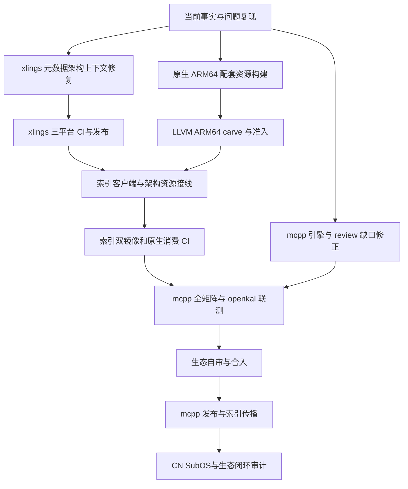

# LLVM 23.1.3 Part 2：任务依赖与生态交付记录

本记录落实 [Part 2 方案](2026-10-08-llvm-2313-linux-aarch64-ecosystem-part2-design.md)。
状态只根据代码、构建进程、CI、发布资源和真实消费结果更新。未执行的门不计为完成。
维护者已授权实现、每仓库集中 PR、CI 修复、发布、CN 镜像补传、SubOS 实测及已完成 issue 的关闭。

## 1. 架构边界与任务依赖

LLVM 与 glibc 是原生 aarch64 的新默认组合；x86_64 保持 GCC，显式旧配置保留。
资源选择按客户端进程 ABI，不能以硬件架构替代；这保持 Rosetta、WOW64 和 Linux emulation 的一致性。
同一 glibc loader 与核心库来源绑定是稳定性门。libc++ 与 libstdc++ 的 C++ ABI 不混用。

## 2. 仓库交付与责任

| 任务 | 仓库与跟踪 | 依赖 | 验收依据 | 当前状态 |
|---|---|---|---|---|
| T1 review 修正与引擎默认 | [mcpp #784](https://github.com/mcpp-community/mcpp/issues/784)，沿用 #781 | T4 公开资源后完整 CI | 冷 home、默认双轴、GNU native、自举、modules、Windows 诊断 | 实现中 |
| T2 ARM64 配套与 carve | [xim-pkgindex #937](https://github.com/openxlings/xim-pkgindex/issues/937) | 原生构建机 | 架构、来源摘要、loader/runtime、编译运行 | 原生构建已启动 |
| T3 配方元数据上下文 | [xlings #647](https://github.com/openxlings/xlings/pull/647)，关联 #646 | 现有 libxpkg LoaderContext | metadata 与 install 相同架构；三平台回归 | 本地验证通过，CI 中 |
| T4 索引接线与镜像 | [xim-pkgindex #938](https://github.com/openxlings/xim-pkgindex/pull/938) | T2、T3 发布 | 每架构哈希、旧版本拒绝、双镜像 GET、消费门 | draft |
| T5 原生与生态消费 | mcpp、xlings、mcpp-index、openkal | T1、T4 | 原生 ARM64、CN SubOS sandbox、真实 build/test/run/pack | 待资源与客户端就绪 |
| T6 自审与发布 | mcpp、xlings、资源与索引 | T1–T5 | 最终头 CI、发版产物、指针传播、消费审计 | 待前置门 |

单个仓库的实现集中在一个 PR：mcpp 沿用 #781，索引使用 #938；xlings 因实测发现客户端缺陷而新增必要 PR。
发布版本同时纳入相应实现 PR。发布后生成的资源索引更新依赖已发布摘要，若不能纳入尚未合入的索引 PR，
使用必要的自动索引收尾 PR；bootstrap pin 也只在资源已公开且索引传播后前移。该依赖不能通过提前填写未来版本规避。

## 3. 多角度验收

| 角度 | 约束 | 可验证证据 |
|---|---|---|
| 架构 | runtime、target、client ABI 分别命名 | ELF、LoaderContext、GNU/musl target 与解析报告 |
| 稳定性 | loader 与 libc 同源、私有共享库闭包 | NEEDED、INTERP、RUNPATH、运行与 relocation 探针 |
| 简洁性 | 使用现有 host row、两包 carve、统一 recipe loader | 无新 toolchain 语法、无第二套资源解析器 |
| 用户体验 | 新安装不要求手工装配依赖 | new/build/run 冷安装及诊断 |
| 兼容性 | 旧配置与历史版本保持事实边界 | 旧 LLVM 在 ARM64 不误报可装，旧 x86 recipe 不回归 |
| 跨平台 | 只扩展已发布架构，不扩大 GNU cross 承诺 | 各宿主矩阵与具名 refusal |
| 一致性 | 元数据读取与 install 使用同一上下文 | live recipe、catalog、安装对照测试 |
| 升级 | 保留声明，说明双轴差异，不悄悄改 ABI | fresh 与 retained defaultTarget、prebuilt/BMI 失效检查 |
| 覆盖 | capability、分片和缓存前提必须可观察 | 按镜像完整分片，890 冷安装，candidate 精确钉 |
| 生态 | 索引与发布版客户端实际协作 | CN sandbox、mcpp-index、openkal 运行与 pack |

## 4. 已取得的证据

2026-10-08：发布版 xlings 2026.10.4.1 在隔离 XLINGS_HOME 中通过 add-xpkg 和 info
读取 `description = os.arch()` 的 live recipe，输出 `recipe architecture: unknown`。
代码核查确认 catalog 元数据读取省略 LoaderContext，install 则传入平台与进程架构。
T3 将两者统一；这项必要客户端修复应在新 ARM64 loader metadata 公开前发布。

索引原生资源构建：[run 37684733504](https://github.com/openxlings/xim-pkgindex/actions/runs/37684733504)，
ubuntu-24.04-arm，生成 UAPI、zlib、libxml2、gcc-runtime、glibc 和 LLVM 双包。
这是运行中的构建，尚无资源通过或发布结论。

本地测试按变更契约聚焦执行，避免用重复测试占据资源制作与集成时间。
最终闭环审计仍须逐项覆盖方案 G0–G9；局部通过不能替代整个生态已可用。

## 5. 集中 PR 当前证据

2026-10-08：mcpp #781 已推送 `42e8b884`，包含 Part 2 默认接线、
review 修正与候选发布版本 2026.10.8.1。ARM64 native GNU 仍为 preview；
实测矩阵与完整生态消费尚未准入。临时报告及本地 dist 未纳入提交。

xlings #647 的 `276fce5` 统一配方上下文，版本两处均为 2026.10.8.1。
本地构建通过，catalog 套件 48 通过、9 项因索引 fixture 缺席跳过。
完整单测执行得到 57 个测试程序通过、1 个失败；失败来自既有 progress
测试在当前 TERM=dumb 下的颜色断言。该程序以 TERM=xterm 复验 7/7 通过。
这些局部证据不替代发布版三平台 CI。

xim-pkgindex #938 已推送 `193f910e`，冻结五种依赖源码的下载摘要，
加入许可证、provenance 与 ELF 清单。静态及隔离套件 4053 通过，
15 跳过、952 未选入、3 项既有 xpass；架构与客户端门 11/11 通过。
原生资源首轮 CI 已完成依赖构建并进入 glibc；新提交将生成包含完整
来源记录的资源。尚未写入 ARM64 公开路由或占位摘要。

## 6. 2026-10-08 最终头缺口与客户端发布

mcpp `42e8b884` 的 CI 已结束，存在五个失败检查：Linux E2E 分片、
xcode-27 E2E 分片、ARM64 matrix、其依赖 coverage，以及 bare-Windows。
Linux 641 将通用能力列表中的 Android 名称误判为实际目标选择；修正
需要对解析出的 Linux C ABI 作正向断言。macOS 230 使用 benchmark 的
旧 LLVM 常量，Xcode 27 链接失败；benchmark 当前常量更新，历史测量
记录继续保持原版本与数字。

ARM64 matrix 的失败包含旧客户端选取 x86 glibc loader 和公开资源
缺席。新的客户端、每架构配方和真实资源路由均是它的前置条件。coverage
随 matrix 未完成失败，不构成另一个已定位的引擎故障。Windows 现场
驱动搜索目录与已验证归档版本不一致，新增字节哈希、改名启动及原生
启动对照；根因尚未确定，不按基础设施故障豁免准入。

xlings #647 在 `276fce5` 上的 9 个检查全部通过，自审确认 metadata、
overlay、本地校验和安装复用同一进程 ABI 上下文。PR 已 squash 合入
`c55d89aa`，关联 #646 随合入关闭。普通合入需要 reviewer；用户已授权
完整合入与发布，按该仓库贡献流程，在全部检查通过后使用管理员合入。
[2026.10.8.1 发布工作流](https://github.com/openxlings/xlings/actions/runs/37690643833)
已经启动。发版成功、CN 补传、索引传播和 mcpp bootstrap pin 前移仍须
以公开资源与消费证据证明。
