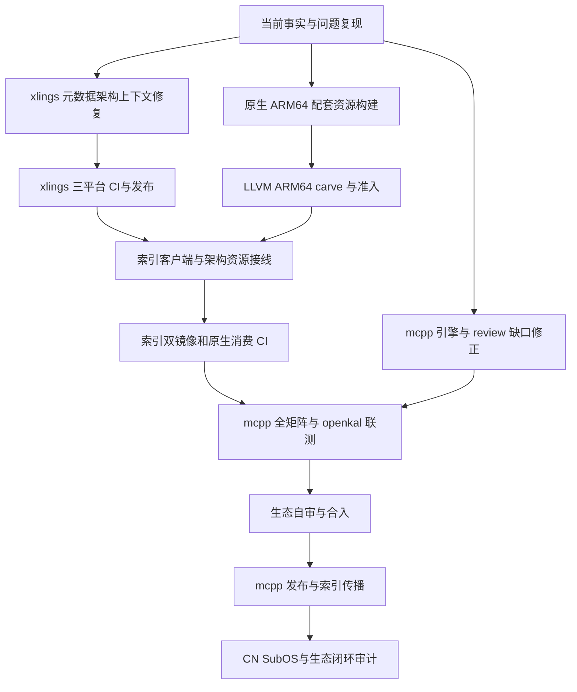

# LLVM 23.1.3 Part 2：任务依赖与生态交付记录

本记录落实 [Part 2 方案](2026-10-08-llvm-2313-linux-aarch64-ecosystem-part2-design.md)。
状态只根据代码、构建进程、CI、发布资源和真实消费结果更新。未执行的门不计为完成。
维护者已授权实现、每仓库集中 PR、CI 修复、发布、CN 镜像补传、SubOS 实测及已完成 issue 的关闭。

## 1. 架构边界与任务依赖

LLVM 与 glibc 是原生 aarch64 的新默认组合；x86_64 保持 GCC，显式旧配置保留。
资源选择按客户端进程 ABI，不能以硬件架构替代；这保持 Rosetta、WOW64 和 Linux emulation 的一致性。
同一 glibc loader 与核心库来源绑定是稳定性门。libc++ 与 libstdc++ 的 C++ ABI 不混用。

## 2. 仓库交付与责任

| 任务 | 仓库与跟踪 | 依赖 | 验收依据 | 当前状态 |
|---|---|---|---|---|
| T1 review 修正与引擎默认 | [mcpp #784](https://github.com/mcpp-community/mcpp/issues/784)，沿用 #781 | T4 公开资源后完整 CI | 冷 home、默认双轴、GNU native、自举、modules、Windows 诊断 | 实现中 |
| T2 ARM64 配套与 carve | [xim-pkgindex #937](https://github.com/openxlings/xim-pkgindex/issues/937) | 原生构建机 | 架构、来源摘要、loader/runtime、编译运行 | 原生构建已启动 |
| T3 配方元数据上下文 | [xlings #647](https://github.com/openxlings/xlings/pull/647)，关联 #646 | 现有 libxpkg LoaderContext | metadata 与 install 相同架构；三平台回归 | 本地验证通过，CI 中 |
| T4 索引接线与镜像 | [xim-pkgindex #938](https://github.com/openxlings/xim-pkgindex/pull/938) | T2、T3 发布 | 每架构哈希、旧版本拒绝、双镜像 GET、消费门 | draft |
| T5 原生与生态消费 | mcpp、xlings、mcpp-index、openkal | T1、T4 | 原生 ARM64、CN SubOS sandbox、真实 build/test/run/pack | 待资源与客户端就绪 |
| T6 自审与发布 | mcpp、xlings、资源与索引 | T1–T5 | 最终头 CI、发版产物、指针传播、消费审计 | 待前置门 |

单个仓库的实现集中在一个 PR：mcpp 沿用 #781，索引使用 #938；xlings 因实测发现客户端缺陷而新增必要 PR。
发布版本同时纳入相应实现 PR。发布后生成的资源索引更新依赖已发布摘要，若不能纳入尚未合入的索引 PR，
使用必要的自动索引收尾 PR；bootstrap pin 也只在资源已公开且索引传播后前移。该依赖不能通过提前填写未来版本规避。

## 3. 多角度验收

| 角度 | 约束 | 可验证证据 |
|---|---|---|
| 架构 | runtime、target、client ABI 分别命名 | ELF、LoaderContext、GNU/musl target 与解析报告 |
| 稳定性 | loader 与 libc 同源、私有共享库闭包 | NEEDED、INTERP、RUNPATH、运行与 relocation 探针 |
| 简洁性 | 使用现有 host row、两包 carve、统一 recipe loader | 无新 toolchain 语法、无第二套资源解析器 |
| 用户体验 | 新安装不要求手工装配依赖 | new/build/run 冷安装及诊断 |
| 兼容性 | 旧配置与历史版本保持事实边界 | 旧 LLVM 在 ARM64 不误报可装，旧 x86 recipe 不回归 |
| 跨平台 | 只扩展已发布架构，不扩大 GNU cross 承诺 | 各宿主矩阵与具名 refusal |
| 一致性 | 元数据读取与 install 使用同一上下文 | live recipe、catalog、安装对照测试 |
| 升级 | 保留声明，说明双轴差异，不悄悄改 ABI | fresh 与 retained defaultTarget、prebuilt/BMI 失效检查 |
| 覆盖 | capability、分片和缓存前提必须可观察 | 按镜像完整分片，890 冷安装，candidate 精确钉 |
| 生态 | 索引与发布版客户端实际协作 | CN sandbox、mcpp-index、openkal 运行与 pack |

## 4. 已取得的证据

2026-10-08：发布版 xlings 2026.10.4.1 在隔离 XLINGS_HOME 中通过 add-xpkg 和 info
读取 `description = os.arch()` 的 live recipe，输出 `recipe architecture: unknown`。
代码核查确认 catalog 元数据读取省略 LoaderContext，install 则传入平台与进程架构。
T3 将两者统一；这项必要客户端修复应在新 ARM64 loader metadata 公开前发布。

索引原生资源构建：[run 37684733504](https://github.com/openxlings/xim-pkgindex/actions/runs/37684733504)，
ubuntu-24.04-arm，生成 UAPI、zlib、libxml2、gcc-runtime、glibc 和 LLVM 双包。
这是运行中的构建，尚无资源通过或发布结论。

本地测试按变更契约聚焦执行，避免用重复测试占据资源制作与集成时间。
最终闭环审计仍须逐项覆盖方案 G0–G9；局部通过不能替代整个生态已可用。

## 5. 集中 PR 当前证据

2026-10-08：mcpp #781 已推送 `42e8b884`，包含 Part 2 默认接线、
review 修正与候选发布版本 2026.10.8.1。ARM64 native GNU 仍为 preview；
实测矩阵与完整生态消费尚未准入。临时报告及本地 dist 未纳入提交。

xlings #647 的 `276fce5` 统一配方上下文，版本两处均为 2026.10.8.1。
本地构建通过，catalog 套件 48 通过、9 项因索引 fixture 缺席跳过。
完整单测执行得到 57 个测试程序通过、1 个失败；失败来自既有 progress
测试在当前 TERM=dumb 下的颜色断言。该程序以 TERM=xterm 复验 7/7 通过。
这些局部证据不替代发布版三平台 CI。

xim-pkgindex #938 已推送 `193f910e`，冻结五种依赖源码的下载摘要，
加入许可证、provenance 与 ELF 清单。静态及隔离套件 4053 通过，
15 跳过、952 未选入、3 项既有 xpass；架构与客户端门 11/11 通过。
原生资源首轮 CI 已完成依赖构建并进入 glibc；新提交将生成包含完整
来源记录的资源。尚未写入 ARM64 公开路由或占位摘要。

## 6. 2026-10-08 最终头缺口与客户端发布

mcpp `42e8b884` 的 CI 已结束，存在五个失败检查：Linux E2E 分片、
xcode-27 E2E 分片、ARM64 matrix、其依赖 coverage，以及 bare-Windows。
Linux 641 将通用能力列表中的 Android 名称误判为实际目标选择；修正
需要对解析出的 Linux C ABI 作正向断言。macOS 230 使用 benchmark 的
旧 LLVM 常量，Xcode 27 链接失败；benchmark 当前常量更新，历史测量
记录继续保持原版本与数字。

ARM64 matrix 的失败包含旧客户端选取 x86 glibc loader 和公开资源
缺席。新的客户端、每架构配方和真实资源路由均是它的前置条件。coverage
随 matrix 未完成失败，不构成另一个已定位的引擎故障。Windows 现场
驱动搜索目录与已验证归档版本不一致，新增字节哈希、改名启动及原生
启动对照；根因尚未确定，不按基础设施故障豁免准入。

xlings #647 在 `276fce5` 上的 9 个检查全部通过，自审确认 metadata、
overlay、本地校验和安装复用同一进程 ABI 上下文。PR 已 squash 合入
`c55d89aa`，关联 #646 随合入关闭。普通合入需要 reviewer；用户已授权
完整合入与发布，按该仓库贡献流程，在全部检查通过后使用管理员合入。
[2026.10.8.1 发布工作流](https://github.com/openxlings/xlings/actions/runs/37690643833)
已经启动。发版成功、CN 补传、索引传播和 mcpp bootstrap pin 前移仍须
以公开资源与消费证据证明。

## 7. 2026-10-08 客户端就绪与候选消费准入

xlings v2026.10.8.1 已公开发布，四平台构建及候选发布物检查通过。
本地补传 CN 后，四个平台的 GLOBAL/CN 二进制重下载摘要均与发布
sidecar 一致。必要索引收尾 [#939](https://github.com/openxlings/xim-pkgindex/pull/939)
在 17 个检查通过、1 个版本变更门按契约跳过后合入 `f8ad78a0`。
mcpp 的客户端钉点与全部当前 CI/release 读取者前移至这个已发布版本；
mcpp 自举 pin 仍保持已发布的 2026.9.24.1。版本钉点检查通过。

第 6 节关于 Windows 驱动版本不一致的推断在此撤回。两轮诊断循环
枚举了 payload 和 SubOS shim，却使用同名报告，shim 覆盖了 payload
结果。`bed48766` 的现场摘要证明 payload g++ 与 cc1plus 均与钉住的
GCC 16.1.0 归档一致。新诊断分别保存驱动与 shim，并执行真实 C++
编译及 PowerShell 长路径/8.3 路径对照；根因尚未确定。

`bed48766` CI 的 Linux 第三分片、两镜像 macOS 第一分片与 Windows
第三分片共同失败于 233：benchmark 常量为 LLVM 23.1.3，而 matrix
仍钉旧版本。当前 matrix 两个 LLVM 钉点同步，检查器支持现有常量
引用；完整 233 本地通过。历史测量与历史源码 pin 保持原记录。

受管 Clang 头文件策略增加 `-nostdlibinc`，同时覆盖 driver config
与 mcpp 显式 compile tokens，修复 revision 为 hermetic-5-managed-headers。
本地真实 compile database 与预处理追踪确认 glibc、UAPI、resource
来自受管路径；宿主 sqlite3.h 存在，受管策略拒绝，而 ambient 控制
可读。linkmodel 17/17、133 freestanding、804 host helper 和 GCC musl
编译运行通过。该证据属于本地 x86_64，不能替代原生 ARM64 准入。

为解除候选索引与 mcpp 合入的依赖环，已有 ARM64 fresh-install
workflow 增加手动候选入口：使用明确索引 ref 和当前 mcpp 提交的成功
原生 build artifact。入口验证来源仓库、完整 commit、workflow、原生
成功 job 与唯一未过期 artifact，分别为外层 home 和冷 home 注入候选
索引并核对有效 registry。5 个合同测试通过。普通发布版 cold-install
入口继续消费公开索引；手动候选证据不能替代发布后的冷消费。

索引原生来源构建 [37689904325](https://github.com/openxlings/xim-pkgindex/actions/runs/37689904325)
已成功。最新准入首次执行在九份归档摘要全部通过后发现检查清单错误：
要求了 Unix carve 未交付的 llvm-strings。该工具属于现有 Windows
manifest，已修正准入清单而保持来源构建和资源字节不变。后续使用
同一成功来源构建重跑准入；公开上传仍依赖全部原生门通过。

## 8. 2026-10-08 原生资源准入与 openkal 宿主扩展

[37695531148](https://github.com/openxlings/xim-pkgindex/actions/runs/37695531148)
的 native-assets job 已通过，准入提交为 `984d468b`，来源提交为
`6ebe2179`。九份归档摘要核验，13 个工具进程的受管依赖、宿主头文件
负向门、默认 Tokyo/UTC、C.UTF-8、GBK、NSS、CRT，以及 std/std.compat
编译和程序运行均通过。上次数据门失败来自准入脚本误拼预留前缀；
这次匹配源码与配方实际的 255 字节占位串，并断言替换发生。原归档
字节保持不变。该成功 job 已触发 GLOBAL 上传；尚不构成公开索引启用。

候选 mcpp 原生入口继续增加真实 GNU 自举：当前头 ARM64 build artifact
编译 LLVM 23.1.3 GNU mcpp，再由该新二进制运行完整单测、LLVM path
host helper、四个真实索引成员和 openkal。消费者命令显式带工具链
与 GNU target；6 个合同测试通过。本地当前代码自举 93.57 秒成功。
以上 workflow 内容尚须原生 runner 执行，不能将配置检查计为生态消费通过。

维护者新增 aarch64 开发宿主的 openkal 交叉路线，已加入方案第 14 节。
既有 openkal-cross 扩为四宿主乘三目标，新增 ARM64 Linux 构建列，
目标系统分别运行全部四宿主产物；运行 job 不安装工具链或 C/C++ runtime。
源码 SHA、候选 LLVM 与输出架构均留下证据，原生 286 仍单独验收。
12 个构建和运行组合尚未实跑，不从旧三宿主结果推导新增列已通过。

## 9. 2026-10-08 双镜像与候选工作流更正

GLOBAL 上传工作流已成功。本地 gtc 补齐九份 ARM64 归档与各自 sidecar；
构建产物、GLOBAL 实际 GET、CN 实际 GET 的大小和 SHA256 全部一致，
结果为 9/9。候选索引七份配方使用实际摘要，旧架构资源保持原身份。
70 项专项测试、4094 项静态/隔离测试及 revision 检查通过；消费者
准入仍未完成，不将资源公开发布等同于默认已可用。

c29e53df 的 fresh-install workflow 在启动前失败，GitHub annotation
明确指出 job 级 env 不允许 runner.temp，没有任何 job 执行。报告目录
初始化移入 step，通过 GITHUB_ENV 传递；普通发布版入口保持原样。
工作流校验增加针对该上下文错误的拒绝门，并验证合法 step 和字符串
字面量不误报；18 个 fixture 检查通过。候选源二进制仍要求同一提交，
修正推送后须等待新头的 ARM64 构建，不复用旧头作为最终准入证据。

## 10. 2026-10-08 原生消费门两项更正

同一 mcpp 提交 821f216a 的 ARM64 构建成功后，候选消费运行
37697997630 正确下载 ARM64 资源，但 glibc 安装守卫使用了执行器
重新加载配方时尚未绑定的顶层 os.arch。索引 45e283b9 改为核对
目录解析传入的 self_exports.loader 与 ABI；31 项聚焦测试验证
正确 ARM64 上下文放行及错误 loader、ABI 和缺失上下文拒绝。
归档与摘要保持原身份。

第二次消费运行 37698398860 已安装并启动原生 LLVM，随后冷项目
创建失败：准入脚本把绝对路径传给接受项目名的 mcpp new。两处
调用改为在工作目录创建 native-probe 与 musl-probe；真实 CLI
创建验证、脚本语法及六项候选协议测试通过。完整原生消费仍需在
修正后的提交重新执行，不能将前置安装成功计作自举或生态通过。

最终索引头的资源门 37698499496 复用成功来源构建 37689904325，
先验证构建脚本与来源一致，再重新执行原生准入，结果成功。
旧头及排队中的重复全量构建取消；该复用不覆盖安装消费门，也
不重新发布任何已钉住的归档。

## 11. 2026-10-08 Windows 前端查找根因更正

同一头 9229b979 的 Windows 单测与打包成功后，bare Windows
[113062257150](https://github.com/mcpp-community/mcpp/actions/runs/37699239809/job/113062257150)
再次失败，独立驱动目录保留了真实载荷与 shim 的不同证据。真实
g++ 16.1.0 的摘要与归档一致；cc1plus 直接编译 C++ 源成功并生成
汇编。PowerShell 长路径和完整 8.3 路径调用均失败，两个驱动搜索
列表都把辅助程序前缀指向全局 xim-x-gcc，载荷自身的安装前缀正确。
这组对照排除了短路径单独致错及辅助程序缺失的解释。

最终根因为本 PR 的测试版本抽象层导出了 GCC_ROOT。182 在创建
隔离 MCPP_HOME 前加载该层，GCC_ROOT 因而指向全局通用 GCC 目录。
[GCC 的前缀处理](https://github.com/gcc-mirror/gcc/blob/master/gcc/prefix.cc)
将 GCC_ROOT 作为驱动控制变量，替换辅助程序及库的搜索根；隔离的
MinGW 载荷因此查不到自身的 cc1plus。原环境快照仅包含
GCC_EXEC_PREFIX，遗漏了这个变量。此前把失败归因为 Windows 底镜像
滚动或 Defender 的结论撤回；15.2.0 搜索列表来自被覆盖的 shim
报告，亦不能用于推断真实 16.1.0 驱动。本次归因由独立真实载荷
报告与 GCC 源码支持，基础设施假设不再作为合入豁免。

测试路径变量改为 MCPP_E2E_GCC_ROOT，保持用户原有 GCC_ROOT 不变。
诊断同时捕获 GCC_ROOT、BINUTILS_ROOT 及测试路径变量。真实 Linux
GCC 16.1.0 对照验证：正常环境编译成功；显式不存在的 GCC_ROOT
使驱动返回裸 cc1plus 并编译失败；加载修正后的测试层保留两种
行为。四项聚焦测试、Bash 语法及差异检查通过。此修复也消除原生
ARM64 消费门切换至 musl GCC 时同一测试变量造成的前端查找污染，
但 Windows 与 ARM64 的最终通过状态仍须新头执行确认。引擎算法、
编译器归档及镜像摘要不变，无须重新发布资源。

## 12. 2026-10-08 Windows 回归通过与原生 GNU 单测证据

提交 553861c4 的 [bare Windows job](https://github.com/mcpp-community/mcpp/actions/runs/37701315331/job/113069650755)
通过首次 fallback、配置持久化、独立 exe 与显式选择验证；同头 Windows
单测与打包亦通过。该结果验证第 11 节的 GCC_ROOT 根因修复，不能将
此前失败继续作为基础设施豁免。测试抽象层的四项回归纳入 CI fixture
门。Ubuntu GCC 13 不处理本次 GCC_ROOT 控制，而生态 GCC 16 处理；
测试分别保持真实驱动的基线，显式选择生态驱动时要求负控制重现失败。

同头 [原生候选消费门](https://github.com/mcpp-community/mcpp/actions/runs/37701961377)
已通过 LLVM/GNU 冷安装、头文件隔离、std/std.compat、打包部署、
GCC-musl 回归及 GNU 自举。完整单测为 145/147：工具链注册测试仍
将非 x86 Linux 的原生 GCC 映射写成 gcc，现改按实际 musl-gcc
载荷验证；ELF 测试发现静态 libunwind 的 32 个动态导出符号。
GNU host helper、四个真实索引成员与 openkal 原生消费尚未执行。

ARM64 与 x86_64 的 libunwind.a 都具有默认可见的全局符号。
使用同一 ARM64 候选归档交叉链接的异常程序在 QEMU 下运行成功，
静态归档组合导出零个 unwind 符号；额外链接 libunwind.so 则导出
31 个并增加对应 DT_NEEDED。这是定位对照，不能替代原生消费证明。
失败门补存实际测试 ELF、readelf 结果与 build.ninja，再根据链接
闭包判断原因；尚不调整资产、不隐藏导出以替代动态依赖诊断。

## 13. 2026-10-08 静态 unwinder 的驱动追加项更正

第 12 节的强化对照使用同一 ARM64 候选 glibc、libc++、libc++abi
与 libunwind，加入 filesystem、thread、exception_ptr 和 runtime_error。
静态链接组合导出零个 unwind 符号；按驱动顺序追加
`--as-needed libunwind.so --no-as-needed` 后导出 31 个，两者均在
QEMU 下运行成功，DT_NEEDED 均仅为 libc.so.6 与 libm.so.6。
因此，额外动态库即使最终被丢弃，LLD 扫描时对静态定义的导出提升
仍会保留；第 12 节简单对照中的额外 DT_NEEDED 不是必要条件。

distribution 的 ELF self-contained 分支已经显式链接 libunwind.a，
现以末尾 `--unwindlib=none` 停止 Clang 再追加动态 unwinder。该更正
保留显式静态归档；foreign C++ runtime 分支仍用 libgcc，未提供
静态归档时仍报告运行依赖，toolchain-coupled 分支仍由驱动选择。
资产摘要与符号可见性不变，不以隐藏导出替代运行时闭包验证。
原生完整单测和后续消费门仍须在新提交执行；QEMU 对照只作为根因
与链接机制的聚焦证据。

修正后的 distribution 单测 43/43 通过，新引擎自举通过，使用新引擎
构建的 ELF 单测 22 项通过，另有一项非 Linux 分支按既有条件跳过。
实际 Ninja 链接行包含 `--unwindlib=none`。同一 ARM64 Clang 驱动的
对照显示自动 `-lunwind` 消失，unwind 导出从 31 个降至零，两个
程序在 QEMU 下均运行成功且仅依赖 libc/libm。随后提交仍须完成
原生全量消费及最终 CI，未将聚焦测试计作发布准入。

发布后的原生 ARM64 CN SubOS 验证另有手动工作流，直接下载并
核对公开 CN 的精确客户端与 mcpp 归档，在冷 home 中实际执行
SubOS、GNU 默认构建、打包部署、四个索引成员及 openkal；三个
交叉产物由对应目标 runner 实际运行。sandbox backend 明确记录
为发行版 CI 基础设施，不冒充索引尚未交付的 ARM64 backend 包。
该工作流须待正式发布、镜像与索引就绪后执行。

## 14. 2026-10-08 原生 GNU 完整通过与 openkal 宿主模块更正

提交 b67e9283 的原生候选门通过 GNU 自举、完整单测 147/147、
804 的 LLVM 宿主工具案例及 cjson、sqlite3、fmtlib.fmt、nlohmann.json
四个真实索引成员。此前 ELF 动态导出与显式 GCC 请求的载荷映射
失败均已消除。最后的 openkal 原生门仍失败：openkal-musl 的
build.mcpp 导入宿主 std.pcm 时，Clang 报目标特征 `-fmv` 不一致。
这不是目标 musl 源码缺失，也不作为资源或基础设施豁免。

宿主 std PCM 只使用 host_compile_tokens；build.mcpp 在同一次
驱动调用中组合 host_compile_tokens 与 host_link_tokens。后者的
`--rtlib=compiler-rt` 在 AArch64 还影响代码生成特征，因此此前
两者的配置不同。现由 cfg bypass 且使用 payload C++ runtime
的共享编译参数生产者同时声明这一运行时选择，使 std PCM 与
宿主程序一致。图供应的目标 runtime、SDK sysroot、GCC、x86
及信任 cfg 的路径保持各自选择；未向宿主导入目标平台参数。
新版缓存身份从实际 std 构建命令导出，无须复用配置不相容的 PCM。
完整原生门及 openkal 生态消费仍须新提交验证。

共享生产者的 HostFlags 聚焦单测 29/29 通过。实际 ARM64 std.cppm
对照使用受管 libc++、glibc 与 UAPI 头文件：旧 PCM 构建成功，但
带 compiler-rt 的导入者重现 FMV/outline-atomics 不一致；两边统一
后，PCM、std 对象与同一导入者均编译成功，并以候选 ARM64 运行时
链接后在 QEMU 下运行成功。该结果验证配置一致性的根因修复，
原生 openkal 全量构建仍作为独立准入门。

## 15. 2026-10-08 原生 GNU 与 openkal 完整消费准入

原生候选门 [37706303240](https://github.com/mcpp-community/mcpp/actions/runs/37706303240)
在 mcpp 提交 `5a0d70ec75c074bfa57273e8676dd7fd92c4086a` 与索引提交
`84c27c3014e676f2175868627b93494d6bd442e8` 上全部通过。冷安装、
受管头文件负对照、std/std.compat、线程、异常、16 字节原子、共享 C ABI、
GNU 默认构建与打包部署、GCC musl 回归、GNU 自举及完整单测 147/147
均通过；804 的 LLVM 宿主工具案例与四个真实索引成员均成功。

同一原生门的 openkal 286 从依赖图供应 kernel-abi、c-abi 与 c++-abi，
产出 aarch64 静态 ELF，九个程序头中没有 INTERP，并在原生宿主输出
`x0x1x2x3 4`。第 14 节宿主 std PCM 配置更正已由完整生态消费验证。
GNU 默认目标的 tier 据此由 preview 提升为 verified；此声明限于
原生 linux-aarch64 供应，不新增预构建 GNU 交叉载荷的支持声明。

主 CI 同一提交的 Windows 单测与打包 job `113081590235`、bare
Windows job `113084571444` 均成功，支持第 11 节 GCC_ROOT 根因更正。
macOS E2E 48 暴露旧断言将 `--rtlib=compiler-rt` 一律视为仅链接参数；
第 14 节实际 ARM64 对照已证明该选项影响代码生成。测试仅移除对此
参数的禁令，保留其余仅链接参数、私有环境与错误输出检查；本地完整
E2E 48 通过。该测试修正仍须最终提交的 CI 验证。

索引原生资源门与 mcpp 原生消费门均已通过，公开索引切换仍等待
索引 PR 当前提交其余 CI 完成。四宿主三目标实际运行、正式发布、
CN 镜像及发布版 SubOS 消费继续作为独立准入项；本节原生成功不
替代这些证据。

## 16. 2026-10-08 当前原生准入与托管线程覆盖补充

mcpp 提交 `cd6d44b80b1e794c2ff6499c72a3317aff94dedd` 的原生候选门
[37708843400](https://github.com/mcpp-community/mcpp/actions/runs/37708843400)
与同一索引 `84c27c3014e676f2175868627b93494d6bd442e8` 全部通过，
包括 GNU 自举完整单测 147/147、四个真实索引成员及原生 openkal。
同一提交主 CI 的两个 macOS E2E 48 分片均通过，验证第 15 节断言
修正。其 ARM64 公开安装门仍等待索引交付，不计作候选消费失败。

生态覆盖复核发现原有 same-source 示例没有启动线程。原生 GNU
线程测试与主线程异常测试均不能替代 openkal 的托管 TLS/线程
证明。新增的共同线程源码与构建 helper 已接入现有四宿主三目标
矩阵、原生 286、候选 ARM64 门及发布版 CN SubOS 门。

本地 LLVM 23.1.3 与当前 mcpp 实际构建并运行线程示例，使用
openkal-llvm-runtime 提交 `b4198d346cf0682c95dc0e51b5c32b096843ee83`。
两个线程的状态隔离、退出析构与异常展开检查通过。286 原生静态
闭包与原有输出检查通过后，复用同一栈再次构建线程源码，运行
输出 `openkal hosted threads: isolation, destructors and concurrent unwind ok`。
新增源码在 ARM64 与三个外部目标系统上的执行仍须最终 CI 验证。

### 16.1 2026-10-08 fixture 发现更正

本节后续发现新 fixture 的 `.cpp` 后缀被根项目默认的
`tests/**/*.cpp` 发现为独立单测。该源码改为 `.cpp.in` 模板，构建
helper 与 286 复制为实际应用的 `main.cpp`。根项目单测仍为原有
147 项，线程证明来自真实 openkal 栈，不由宿主 GNU 单测替代。

## 17. 2026-10-08 原生线程准入与 Windows helper 路径更正

修正提交 `daa3aab1d5338edee5a14ee3d3fb5d86212873cc` 的候选门
[37713960833](https://github.com/mcpp-community/mcpp/actions/runs/37713960833)
与精确索引 `84c27c3014e676f2175868627b93494d6bd442e8` 全部通过。
完整 GNU 单测恢复为 147/147，四个真实索引成员通过。ARM64
原生 openkal 的静态闭包、原有输出及新增 TLS/线程/并发异常展开
均实际运行成功。此前 `a6cecdb7` 的线程成功保留为历史证据，其
148 项发现结果不计作本节的 147 项准入。

同一提交 Windows openkal job `113106857225` 构建原有 Linux
目标样例成功，线程样例编译链接也在 13.81 秒完成。随后 helper
将 Actions 提供的原生绝对输出路径 `D:\a\_temp/threads-binary.txt`
判作相对路径，错误地加上当前目录，写回路径时失败。该结果属于
测试 helper 的路径错误，不作为 openkal 目标编译或基础设施失败。

helper 在 Windows 的 Bash 环境中先用 `cygpath -u` 规范输出路径，
再判断相对路径；mcpp 的文件路径参数也经过同一转换，裸命令继续
按 PATH 查找。运行时目录由 `cd` 与 `pwd` 获取。该更正不改变
引擎、线程源码或 GNU 单测发现，其 Windows 实际验证仍由随后 CI
承担。

## 18. 2026-10-08 代表性索引库交叉覆盖补充

生态复核确认第 14.3 节第 5 项尚有缺口：四个真实索引成员在
原生 GNU 上通过，不能证明代表性库的 openkal 交叉路径。现有
托管应用增加真实 `nlohmann.json@3.12.0` 模块和行为检查，复用
既有构建与目标运行 job。四宿主记录实际 mcpp-index 提交，目标
门同时检查 JSON 与线程成功行。原生门及正式 CN SubOS 使用实际
索引 checkout 供应同一库，原有上游 same-source 示例保留。

本地使用 mcpp-index 提交 `5fc151e0abed68788d9fa7b47e6e3ccb50607706`
与 openkal-llvm-runtime 提交 `b4198d346cf0682c95dc0e51b5c32b096843ee83`，
真实 JSON 模块与应用构建成功。原生应用实际运行 JSON 序列化、
解析、字面量、键序及 TLS/线程检查，286 的静态闭包与双成功行
检查通过。macOS ARM64 与 Windows x64 交叉编译链接分别在
10.70 秒与 7.08 秒完成，其产物架构及 OS 依赖闭包通过检查；
这两份产物的目标系统运行仍须后续 CI 验证。

本地线程应用源码模板 SHA256 为
`cc93548236b09d1d6ea388753782069fc847642b98678c2db94b74c4054c6a6b`。
该记录区分第三方模块的实际消费与仅构建 openkal/标准库的旧样例，
不声明未经此门验证的其他库交叉兼容性。

新增库补充提交前，路径修正提交 `3341ae5e` 的 Windows openkal
job `113112389601` 已成功，实际完成原有样例与线程应用的三个
目标构建，验证第 17 节原生 Windows 路径规范化更正。该 job 使用
新增 JSON 行为检查之前的线程源码，不替代本节新增库的最终 CI。

## 19. 2026-10-08 四宿主源码字节一致性更正

Windows job `113112389601` 的线程源码摘要为
`debee4f23a080caf1eb65450aed992dda41f3c5b322fd7d3b468764a242a1d6b`，
而相同提交的 Linux/macOS 摘要为
`ca48c94242e8d38e21503925d1205c75caf074e2c74db858d198d8831a372bc4`。
将仓库源码的 LF 换为 CRLF 可精确复现 Windows 摘要。六份 Windows
构建产物的架构与依赖闭包检查通过，但不能通过源码字节一致性门。

根目录 `.gitattributes` 对该源码模板指定 `text eol=lf`，使 checkout、
复制到应用和计算摘要使用相同字节。该规则不改变摘要算法或运行断言。
使用 `core.autocrlf=true` 的独立 checkout 验证 LF 字节及当前 JSON
模板摘要一致；实际 Windows checkout 的验证由后续 CI 承担。

## 20. 2026-10-08 正式 CN 隔离后端包名更正

Ubuntu 的 `bwrap` 可执行文件由 `bubblewrap` 包供应。正式 CN 工作流
与后端版本记录将 `bwrap` 映射为该包名，实际 SubOS 后端参数及路径
继续使用 `bwrap`。`proot` 的包名与后端名相同。此更正保证所选后端
的安装和来源记录一致；正式 CN 运行仍等待公开发布后的验收。

提交 `8131ca36` 与索引候选 `84c27c30` 的原生 GNU 验收运行
`37717241617` 已成功。实际日志记录 147 个单测程序通过、四个真实
索引成员通过，以及原生 openkal 的 JSON 和 TLS 双成功行。其
mcpp-index 提交为 `b2f1e693248042c445c75fb020d49c428e6a1f78`。
随后源码换行属性与 CN 包名修正不改变此原生引擎及应用源码的行为；
该证据仍不替代最终四宿主目标运行与公开 CN 发布消费。

## 21. 2026-10-08 原生验收与验证作用域补充

提交 `c976c704` 的主 CI `37718202213` 已结束，结果为 44 项通过、
4 项失败、3 项跳过。Linux 单测为 147/147，子系统测试、bare Windows
及普通 ARM64 fresh-install 通过。三个非 ARM 构建宿主各完成原有
示例与 JSON/线程应用的三个目标构建。三条 ARM 失败发生在旧公开
索引的 x86_64 glibc/LLVM 安装阶段；矩阵覆盖失败来自扫描任务因
上游失败而跳过。此结果尚不满足合入条件。

独立检查保留这三个宿主的 18 个真实产物，运行时提交为
`b4198d346cf0682c95dc0e51b5c32b096843ee83`，索引提交为
`b2f1e693248042c445c75fb020d49c428e6a1f78`，应用源码摘要均为
`cc93548236b09d1d6ea388753782069fc847642b98678c2db94b74c4054c6a6b`。
ELF 静态闭包、Mach-O 的 libSystem 依赖及 PE 的五个 OS DLL 依赖
通过检查。三个宿主生成的 Linux 原始示例与 JSON/线程应用均在
本地实际运行通过；Windows/macOS 目标运行仍由后续目标系统门承担。

旧客户端补充试验确认验证作用域不能仅由私有存储目录推定。
从共享项目目录启动会读取项目 `.xlings.json`；`-u` 表示激活，
`-g` 才表示全局作用域。正式 CN 验证显式采用 `-g` 安装公开
mcpp 版本，本地冷目录脚本同样显式安装其 bwrap 后端。当前客户端
`2026.10.8.1` 的实际帮助输出已确认这两项参数语义。

## 22. 2026-10-08 旧客户端独立兼容性补充

公开客户端 `2026.8.10.1` 的归档 SHA256 为
`336b92af2507d54457c3f7836cb93846727903d78a8f75c54142e3d8b57b87c1`。
在全新私有 `XLINGS_HOME` 与非项目工作目录中，保留原有 `HOME`，
使用精确索引 `84c27c3014e676f2175868627b93494d6bd442e8` 的配方
和共享库，显式 `install xim:llvm@23.1.3 -y -g`。实际安装 glibc、
gcc-runtime、Linux UAPI、zlib、libxml2 与 LLVM 六项依赖成功。

LLVM 实际版本为 23.1.3，使用生成的 `clang++.cfg`。C++23 I/O 与
Linux UAPI 程序在移除 `LD_LIBRARY_PATH`、`LD_PRELOAD` 后编译和
运行成功，输出 `PATH_MAX` 值 4096。编译器的系统头文件搜索路径
均来自该私有目录中的 LLVM、libc++、glibc、Linux UAPI 与资源目录。
31 个 ELF、6 个外部 soname 的依赖闭包检查通过。安装器仍调用
宿主 `/usr/bin/patchelf`；此记录不声明安装工具也全部来自私有目录。

该验证使用尚未提交的闭包检查器摘要
`da729a28f870dccedae0fab759c2d4c744a341d4606492b4ece5c6a4a293189d`。
更正仅以遍历键计数替代 Bash 5.2 `nounset` 下空关联数组的长度
读取，保留闭包规则及退出码。glibc 的 293 个 ELF、0 个外部 soname
也实际通过；原检查器在该空集合中会报错后继续运行，不能据其
成功退出推断此分支完整执行。补充结果不替代原始 CI，也不替代
公开索引发布后的兼容性与 ARM64 默认工具链验收。

## 23. 2026-10-08 上游 glibc 修订整合与数据门

公开索引主线提交 `ebf1fbb3417ec513b923279044433887b3af8850`
合入 [xim-pkgindex #940](https://github.com/openxlings/xim-pkgindex/pull/940)，
发布两架构的 glibc revision 2，增加逻辑根目录的 cache/preload 边界。
本分支按正常合并历史整合该变更。GLOBAL 与 CN 的两个 revision 2
归档完整下载及哈希检查通过，但两架构归档均缺少本轮要求的东京/
UTC 时区、已编译 C.utf8、许可证及构建来源清单。离线归档检查
明确失败；该结果不推断安装钩子生成 locale 后的实际行为。

revision 3 保留 revision 2 的逻辑根修复，并补齐运行数据与清单。
仅 glibc 在两个原生架构重建，LLVM 等八个未变归档按原构建来源和
逐文件 SHA256 复用。受限复用模式单独验证新 glibc 的成功构建来源、
构建源码一致性、双镜像字节与库存，默认的完整构建来源检查保留。
构建来源及归档检查不能替代组合后的原生消费验收。

最初的 revision 3 归档门错误地要求时区条目为物理普通文件，拒绝
tar 中合法的 UTC 硬链接；其前置原生数据与 cache/preload 门均通过。
更正后的库存检查读取归档内链接指向的实际内容，并拒绝缺失、空
内容、越出载荷根目录及循环链接。五个真实 tar 回归验证该规则。
运行 [37734176881](https://github.com/openxlings/xim-pkgindex/actions/runs/37734176881)
在提交 `e8f330d45b2b5ca57c608e7ec8d40d6170502cf1` 上，两架构
原生构建、数据门、cache/preload 门和库存检查全部通过。资源发布、
真实哈希激活及最终索引消费门另行记录。

原始索引 job `113066636361` 的最终注记明确说明超过六小时总限；
APT 工具准备阶段没有输出，后续配方安装未开始，不能归因为网络
或其中某条 APT 命令。工具准备增加有界超时后，真正 PR 差异运行
`37733524995` 实际执行七个改动配方的安装、卸载与闭包检查并通过，
工具准备耗时九秒。仅比较上一提交的 push 运行不计作此门的替代。

## 24. 2026-10-08 revision 3 最终资源与原生消费验收

索引候选提交 `6dbec70fce50f6505b00a4c07ee9709db23c62e1` 的最终
检查为 23 项成功、3 项条件跳过、0 项失败。真正 PR 差异安装运行
[37735969006](https://github.com/openxlings/xim-pkgindex/actions/runs/37735969006)
通过。原生组合验收运行
[37735965909](https://github.com/openxlings/xim-pkgindex/actions/runs/37735965909)
及 PR 原生验收 `37735969034` 均通过；两架构 glibc 运行检查
`37735969038` 通过。这些结果采用实际发布的 revision 3 配方。

| 资源 | 字节数 | SHA256 |
|---|---:|---|
| `glibc-2.44.3-r3-linux-aarch64.tar.gz` | 35,500,275 | `33d015ddd07c84d82b8c7cfbe6cf920222d0754c7c777f3818c78c764de5461e` |
| `glibc-2.44.3-r3-linux-x86_64.tar.gz` | 38,371,568 | `2fe32c53a40885ec6d3322135df19dc4fe65835b093b03bfa41502c1eb7abffa` |

以上摘要按源构建、GitHub 资产元数据、GLOBAL 与 CN 完整下载字节
核对一致。资源已经发布不等于索引已经发布；公开索引指针与最低
客户端版本仍须在合入后的发布流水线实际核查。

mcpp 原生 GNU 验收
[37736041779](https://github.com/mcpp-community/mcpp/actions/runs/37736041779)
使用引擎提交 `c976c70482ec9c4320160e125dd7611454fa5738` 和上述
精确索引提交，147 个测试全部通过，四个索引成员均通过，原生
JSON 与 TLS/并发异常应用实际运行通过。父 mcpp sandbox 与 xlings
缓存均未命中，新建父 sandbox 实际安装受管 glibc，GNU 自举产物
使用该目录中的 ARM64 loader。安装 stdout 未直接记录归档 URL、
revision 或摘要；revision 3 身份由精确候选索引的资源钉、父缓存
未命中和全新安装链证明，不能表述为 stdout 直接测得归档摘要。

索引 PR #938 的普通合入被 GitHub ruleset #3055837 拒绝。规则
要求两位 reviewer、code owner、最后推送批准、签名及线性历史；
仓库不支持自动合入。最终源码检查通过不替代 review 规则。当前
等待维护者决定合入途径，尚未声称公开索引消费或最终发布闭环完成。

## 25. 2026-10-08 三条 ARM 安装失败归因更正与合入授权

主 CI `37718202213` 的 ARM 交叉构建 job `113122034520`、原生
openkal job `113122034623` 与矩阵不变量 job `113122034540` 均
在 glibc 的 `__generate_c_utf8` 失败。实际日志明确记录缺失的
`ld-linux-x86-64.so.2` 路径。旧钩子以 `_RUNTIME.arch` 判定 ARM；
该执行上下文未提供相应事实时选择 x86 loader，随后 `localedef`、
LLVM 配置与程序注册依次失败。这些日志不能单独证明下载的归档
本身为 x86，因此第 21 节对旧安装阶段的描述应按本节限定解释。

最终配方将 catalog 的架构运行时导出与安装文件的架构布局分别
作为元数据和钩子的来源，所有钩子统一使用该布局。候选 revision 3
原生门已验证安装前置条件修复；公开索引激活后的普通 CI 仍须
实际通过，不能以候选门替代。

维护者明确授权索引 #938 和 mcpp #781 在改动复核、文件清单检查
及各自最终 CI 通过后使用 bypass squash 合入。本次授权取代之前
保留 merge 历史的偏好。源码构建来源验证须兼容 squash 的提交
映射，并继续要求同仓库成功构建、已合入来源及构建源码一致性；
不能因授权 bypass 合入而删除运行验收或归档身份检查。

## 26. 2026-10-08 索引 squash 合入与公开发布验收

索引 #938 最终头 `48cbebea062cd8e44585dbd7fe307f89bd3e2eec`
检查为 20 项成功、3 项条件跳过、0 项失败。修正新增八个真实 Git
来源映射回归，合计 31 个相关专项测试通过。维护者授权的 bypass
squash 已于 09:57 UTC 完成，实际合入提交为
`dc8bf08363b07f8ae2b6f7b41e0d2f85b0bd8cd2`。完整文件清单没有
日志、归档、编译产物或缓存；来源 JSON 属于被准入流程引用的长期
验收记录。原资源配方与摘要未因 squash 修正而改变。

发布运行
[37760190384](https://github.com/openxlings/xim-pkgindex/actions/runs/37760190384)
成功。GLOBAL raw 指针曾短暂滞后于 GitHub API 和 CN；验收等待
两个公开入口实际一致后才通过，没有以任务成功替代指针消费。
两镜像完整索引归档为 1,456,005 字节，SHA256 均为
`ec0b6329dea9a46179770c7e9a80746cda2544be2a21dd9be2c0519b984d3ed6`，
与发布资产元数据一致。指针 source_commit 为实际 squash 提交，
最低客户端及 client_latest 均为 `2026.10.8.1`；兼容历史 `ebf1fbb`
及其他索引键均保留。下载归档中的两架构 glibc revision 3、ABI、
lib64 loader 与资源摘要契约通过检查。

实际 main 隔离 checkout 验证了原 LLVM 来源 `6ebe2179` 和 glibc
来源 `e8f330d4` 的 squash 映射。已合入 PR 的记录头与实际合入
提交的树均为 `f07e9321fa554924775da53d24e0c72d0f50b66e`；
构建源码一致性、成功构建与归档身份检查继续生效。

公开发布验收通过后，仅一次重跑主 CI `37718202213` 的失败及
下游任务。attempt 2 使用原引擎提交 `c976c704`，保留先前通过的
检查，并实际重验三条 ARM 安装链、四宿主扫描及目标系统运行。
结果与矩阵基线另行记录，不把正在运行的任务写为成功。

## 27. 2026-10-08 公开 ARM 消费与目标实跑通过及 triple 断言更正

主 CI attempt 2 的公开索引安装已通过。原生 ARM openkal 与 ARM
宿主三目标构建均成功，证明此前三条任务的 glibc 安装前置失败已
被实际公开消费修复。三个目标运行 job `113258565860`（macOS）、
`113258565920`（Linux）和 `113258565955`（Windows）全部成功，
实际执行四宿主构建的原示例与 JSON/线程应用。四宿主三目标矩阵
共 24 个二进制，其源码身份、架构与依赖闭包报告分别保留。

attempt 2 为 49 项成功、2 项失败、2 项跳过。剩余直接失败是 299
测试读取 `.data.triple.llvm` 后，只接受简写 `aarch64-linux-gnu`，
却拒绝其有效 LLVM 表示 `aarch64-unknown-linux-gnu`。二者是同一
ARM64 Linux GNU 身份。断言接受这两个精确表示，继续拒绝不同
架构或环境，并保留显式/省略 GNU 段一致性和 x86_64 控制。
诊断中已过时的 GNU planned 文句同步更正。该修正不修改解析器。

四宿主扫描仍因该不变量失败被跳过，覆盖门随之失败；因此还没有
本轮完整矩阵测量。必须先通过不变量，再收集真实扫描输出并回填
基线，不能把目标实跑成功当作扫描覆盖通过。

## 28. 2026-10-08 四宿主实际矩阵与单一编译器轴

运行 [37761833670](https://github.com/mcpp-community/mcpp/actions/runs/37761833670)
对应源码 `e862c65757d8f7215a954b58a15c605370e7a2ee`。四台宿主的
invariants 全部通过；四份扫描归档均已完整采集。扫描报告共 244 格，
Linux x86_64 为 70 格、Linux aarch64 为 66 格、macOS ARM64 为
38 格、Windows x86_64 为 70 格，各宿主分别覆盖 payload 与 graph。

本次声明相对于旧表新增 35 格、更新 18 格。全部旧键保留；每行
11 列，键无重复，没有 build-fail 或 other。新增格全部来自 ARM
宿主：LLVM 编译器轴 33 格，GCC 的 Windows musl 目标 2 格。
ARM 原生 GNU 的 LLVM payload 实际通过，graph 的 GNU、musl、
x86 Linux 与两个 Windows 目标实际通过。GCC 的层要求及非原生
GNU 载荷拒绝采用实测 reason，不再沿用 planned。

四条扫描失败只来自声明与实测差异。声明按四份实际报告更新，同时
删除工作流中临时追加 ARM LLVM 的两个分支。安装与扫描的编译器
集合再次完全取自同一声明列，避免重复扫描或第二个版本钉点。
维护规范删去漂移的固定行数，支持范围由完整表而非注释数字决定。

86 格为 ok，其余为命名拒绝。既有 std-module-precompile 与
lld-required-absent 拒绝没有变化。报告器在 iOS 的五个描述字段
仍有命名局限：aarch64-ios 的 c-abi 输出 glibc(payload)，iOS
simulator 输出 sim(payload)。这些列不参与支持判定，记录其输出
不构成 iOS 链接 glibc 的声明；实际 Apple 依赖以目标验收为准。
基线注释明确这一边界，没有通过修改报告器扩大本次支持范围。

## 29. 2026-10-08 生态 E2E 工具供应统一与非空宿主对照

维护者将后续合入顺序改为检查达标后先报告，由维护者 review 决定。
索引 #938 已在此前明确授权下合入；mcpp #781 未合入、未发布。
源码 `3d90198f` 的运行 37765253396 已通过四宿主构建、invariants、
244 格扫描、三个目标系统执行及 ARM64 fresh-install。剩余生态
E2E 停留在工具准备步骤超过 24 分钟，维护者确认实际日志为空。
上一轮同一步骤为 44 秒；两次 33 MB qemu-riscv 下载分别为 2.2 秒
和 1.4 秒。空输出不能证明具体阻塞在 APT 还是后续命令，不能以此
声明 LLVM 或 openkal 回归，也不能把尚未执行的 E2E 计为通过。

该步骤原来只通过 xlings 安装 qemu-riscv；qemu-user 和用于宿主
头文件对照的 mingw-w64 仍来自 APT。现有索引已提供
qemu-user-aarch64@7.2.0、qemu-riscv@9.2.4-1 及 Linux 宿主的
mingw-cross-gcc@16.1.0。工具供应改为三个具名 xlings 步骤，不再
访问 APT。用户态与系统态模拟器分别安装到两个被调用的 home，
安装作用域和激活版本显式指定；准备后的程序执行仍为准入条件。

索引中的 mingw-w64 是 Windows 载荷，不能用于 Linux 宿主。
Linux 头文件对照使用独立 XLINGS_HOME 中的 mingw-cross-gcc，
目录位于 MCPP_HOME 外。738 仅在自身进程内将该工具链 bin 加入
PATH，不写入 /usr，不导出 GCC_ROOT，不将对照载荷混入被信任的
图供应 store。Clang 无默认配置时能通过 PATH 找到这份真实头文件；
正向控制要求实际预处理 io.h 并报告该 include 目录，才继续验证
图供应命令的搜索目录。CI 除原 PASS 行外还要求正向控制成功行。

本地 LLVM 23.1.3 对照实测：未限制的驱动搜索独立 MinGW include
并成功预处理 io.h；加 nostdlibinc 后该目录消失，io.h 不可找到。
原实际图构建/CDB 隔离判据保留，不以模拟数据或成功退出代替。
本批只改变测试供应与诊断，无引擎、工具链默认值、载荷或运行时
功能改动。新头仍需实际生态 E2E 和最终 CI 成功，之后才交付合入
报告。发布、CN/SubOS 消费及 latest 移动继续等待合入决定。

维护者确认运行卡住后，于 11:42 UTC 取消旧运行。最终为 54 成功、
1 条件跳过、1 取消；准备步骤连续静默约 43 分钟，完整取消日志
仍没有后续命令的实际输出。归档、已完成检查和实测矩阵保留，
不将取消解释为功能通过或 LLVM 回归。工作流和覆盖检查的 25 个
现有专项用例、本批 shell/YAML、版本关系及文档规范检查通过。
